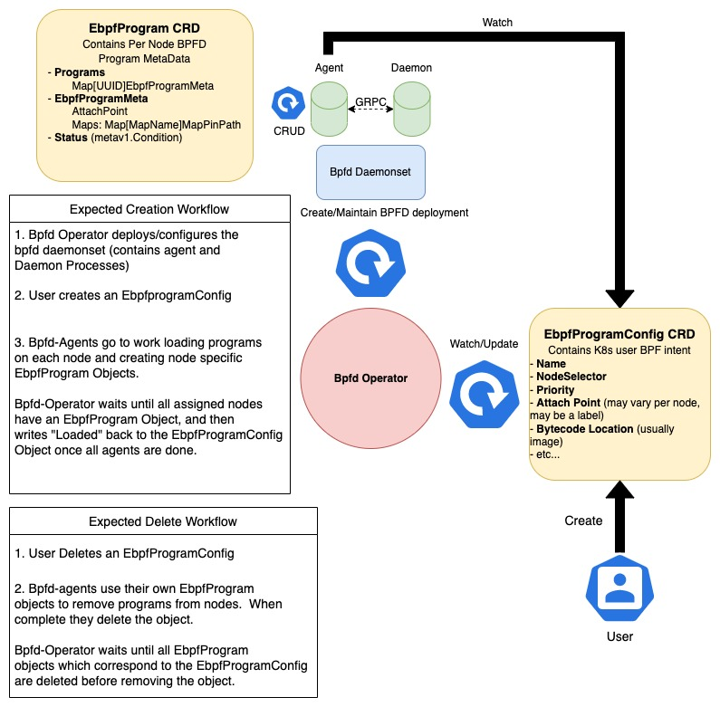

# bpfd-operator

The Bpfd-Operator repository exists in order to deploy and manage bpfd within a kubernetes cluster.



## Description

This repository houses two main processes, the `bpfd-agent` and the `bpfd-operator` along with CRD api definitions for `EbpfProgram` and `EbpfProgramConfig` Objects. In the below sections we'll dive a bit deeper into the API and functionality of both processes.

But first try it out!

## Getting started

This operator was build utilizing some great tooling provided by the [operator-sdk library](https://sdk.operatorframework.io/). A great first step in understanding some
of the fucntionality can be to just run `make help`.

After reviewing the possible targets it's quick and easy to get bpfd deployed locally on your system via a [KIND cluster](https://kind.sigs.k8s.io/). with:

```bash
make run-on-kind
```

The container images used for `bpfd`,`bpfd-agent`, and `bpfd-operator` can also be
configured, by default local image builds will be used for the kind deployment.

```bash
BPFD_IMG=<your/image/url> BPFD_AGENT_IMG=<your/image/url> BPFD_OPERATOR_IMG=<your/image/url> make run-on-kind
```

Then to push and test out any local changes simply run:

```bash
make kind-reload-images
```

### API

#### EbpfProgramConfig

The `EbpfProgramConfig` crd is the bpfd K8s API object most relevant to users and can be used to understand clusterwide state for an ebpf program. It's designed to express how, and where bpf programs are to be deployed within a kubernetes cluster.  An example ebpfProgramConfig which loads a basic `xdp-pass` program to all nodes can be seen below:

**NOTE: Currently the ebpfprogram's bytecode section-name MUST match the `spec.name` field in the ebpfProgramConfig Object.**

```yaml
apiVersion: bpfd.io/v1alpha1
kind: EbpfProgramConfig
metadata:
  labels:
    app.kubernetes.io/name: ebpfprogramconfig
  name: xdp-pass-all-nodes
spec:
  ## Must correspond to image section name
  name: pass
  type: XDP
  # Select all nodes
  nodeselector: {}
  priority: 0
  attachpoint: 
    interface: eth0
  bytecode:
    imageurl: quay.io/bpfd/bytecode:xdp_pass
```

### EbpfProgram

The `EbpfProgram` crd is used internally by the bpfd-deployment to keep track of per node bpfd state such as program UUIDs and map pin points, and to report node specific errors back to the user. K8s users/controllers are only allowed to view these objects, NOT create or edit them.  Below is an example ebpfProgram Object which was automatically generated in response to the above ebpfProgramConfig Object.

```yaml
apiVersion: bpfd.io/v1alpha1
  kind: EbpfProgram
  metadata:
    creationTimestamp: "2022-12-07T22:41:29Z"
    finalizers:
    - bpfd.io.agent/finalizer
    generation: 2
    labels:
      owningConfig: xdp-pass-all-nodes
    name: xdp-pass-all-nodes-bpfd-deployment-worker2
    ownerReferences:
    - apiVersion: bpfd.io/v1alpha1
      blockOwnerDeletion: true
      controller: true
      kind: EbpfProgramConfig
      name: xdp-pass-all-nodes
      uid: 6e3f5851-97b1-4772-906b-3ac69c6a4057
    resourceVersion: "1506"
    uid: 384d3d5c-e62b-4be3-9bf0-c6cf0e315acf
  spec:
    programs:
      bdeac6d3-4128-464e-9161-6010684eca27:
        attachpoint:
          interface: eth0
        maps: {}
  status:
    conditions:
    - lastTransitionTime: "2022-12-07T22:41:30Z"
      message: Successfully loaded ebpfProgram
      reason: bpfdLoaded
      status: "True"
      type: Loaded
```

Applications wishing to use bpfd to deploy/manage their bpf programs in kubernetes will make use of this
object to find references to the bpfMap pin points (`spec.maps`) in order to configure their bpf programs.

### Controllers

The Bpfd-Operator performs a few major functions and houses two major controllers the `bpfd-agent` and `bpfd-operator`.

#### bpf-agent

The bpfd-agent controller is deployed alongside bpfd in a daemonset.  It's main purpose is to watch user intent (in ebpfProgramConfig Objects) and communicate with
bpfd via a mTLS secured connection in order to translate the cluster-wide user-inetent to per node state.

#### bpfd-operator

The bpfd-operator performs the following functionality:

- Reconcile the bpfd daemonset (including both the `bpfd` and `bpfd-agent` processes) so that no manual edits can be completed.
- Report cluster wide state back the the user with each ebpfProgramConfig's status field.

## More useful commands

1. Install Instances of Custom Resources:

```sh
kubectl apply -f config/samples/
```

2. Build and push your bpfd-agent and bpd-operator container images to the location specified by `BPFD_AGENT_IMG` and `BPFD_OPERATOR_IMG`:

```sh
make build-images push-images BPFD_OPERATOR_IMG=<some-registry>/bpfd-operator:tag BPFD_AGENT_IMAGE=<some-registry>/bpfd-agent:tag
```

3. Deploy the operator and agent to a cluster with the image specified by `BPFD_AGENT_IMG` and `BPFD_OPERATOR_IMG`:

```sh
make deploy BPFD_OPERATOR_IMG=<some-registry>/bpfd-operator:tag BPFD_AGENT_IMAGE=<some-registry>/bpfd-agent:tag
```

### Uninstall CRDs

To delete the CRDs from the cluster:

```sh
make uninstall
```

### Undeploy controller

UnDeploy the controller to the cluster:

```sh
make undeploy
```

### Modifying the API definitions

If you are editing the API definitions, generate the manifests such as CRs or CRDs using:

```sh
make manifests
```

## Contributing
// TODO(astoycos): Add detailed information on how you would like others to contribute to this project

### How it works
This project aims to follow the Kubernetes [Operator pattern](https://kubernetes.io/docs/concepts/extend-kubernetes/operator/)

It uses [Controllers](https://kubernetes.io/docs/concepts/architecture/controller/) 
which provides a reconcile function responsible for synchronizing resources until the desired state is reached on the cluster.


## License

Copyright 2022.

Licensed under the Apache License, Version 2.0 (the "License");
you may not use this file except in compliance with the License.
You may obtain a copy of the License at

    http://www.apache.org/licenses/LICENSE-2.0

Unless required by applicable law or agreed to in writing, software
distributed under the License is distributed on an "AS IS" BASIS,
WITHOUT WARRANTIES OR CONDITIONS OF ANY KIND, either express or implied.
See the License for the specific language governing permissions and
limitations under the License.
