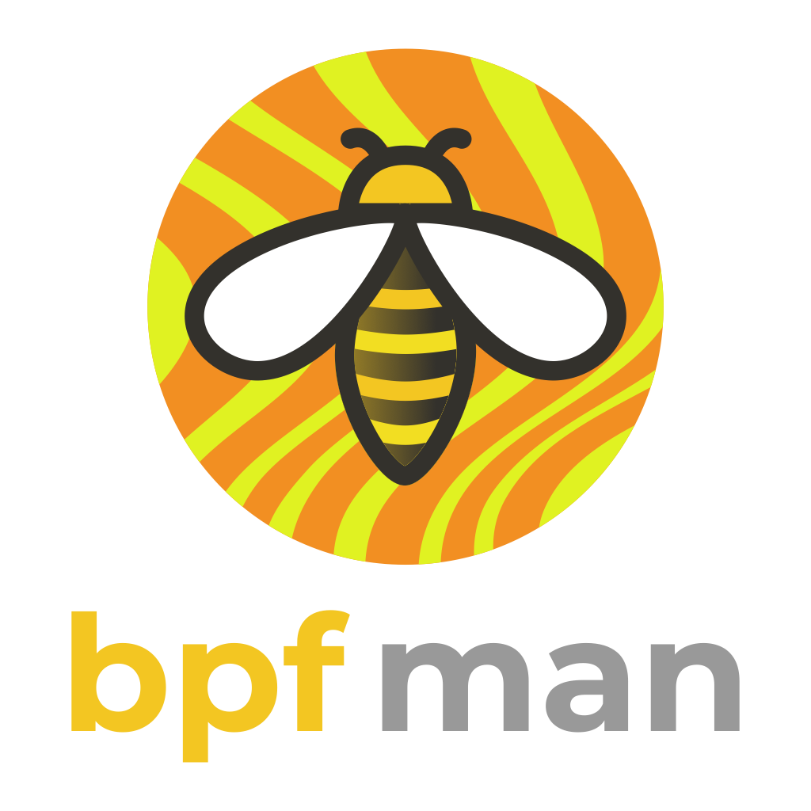

# A New Logo: Using Generative AI, of course

Since we renamed the project to `bpfman` we are in need of a new logo.
Given that the tech buzz around Generative AI is infection, we decided to use
generative AI to create our new logo.

<!-- more -->

## The Brief

I have a love of open source projects with animal mascots, so bpfman
should be no different. The "bee" is used a lot for eBPF related projects.
One such example is [Crabby], the crab/bee hybrid, that I created for the
[Aya] project.

The logo should be cute and playful, but not too childish.
As a nod to [Podman], we'd like to use the same typeface and split color-scheme
as they do, replacing purple with yellow.

One bee is not enough! Since we're an eBPF manager, we need a more bees!

<iframe src="https://giphy.com/embed/QBYeMohXoVUJBtlfFD" width="480" height="276" frameBorder="0" class="giphy-embed" allowFullScreen></iframe>
<a href="https://giphy.com/gifs/teamcoco-oprah-bees-QBYeMohXoVUJBtlfFD">via GIPHY</a>

And since those bees are bee-ing (sorry) managed, they should be organized.
Maybe in a pyramid shape?

[Aya]: https://aya-rs.dev
[Crabby]: https://github.com/crabby-the-crab
[Podman]: https://podman.io

## The Process

We used [Bing Image Creator](https://www.bing.com/images/create/), which is
backed by [DALL-E 3](https://www.microsoft.com/en-us/bing/do-more-with-ai/image-creator-improvements-dall-e-3).

Initially we tried to use the following prompt:

> Logo for open source software project called "bpfman". "bpf" should be yellow
> and "man" should be black or grey. an illustration of some organized bees
> above the text. cute. playful

Our AI overlords came up with:

Not bad, but not quite what we were looking for. It's clear that as smart as
AI is, it struggles with text, so whatever we need will need some manual
post-processing. There are bees, if you squint a bit, but they're not very
organized. Let's refine our prompt a bit:

> Logo for open source software project called "bpfman" as one word.
> The "bpf" should be yellow and "man" should be black or grey.
> an illustration of some organized bees above the text. cute. playful.

That... is worse.

Let's try again:

> Logo for a project called "bpfman".
> In the text "bpfman", "bpf" should be yellow and "man" should be black or grey.
> add an illustration of some organized bees above the text.
> cute and playful style.

The bottom left one is pretty good! So I shared it with the rest of the
maintainers to see what they thought.

At this point the feedback that I got was the bees were too cute!
We're a manager, and managers are serious business, so we need serious bees.

Prompting the AI for the whole logo was far too ambitious, so I decided I would
just use the AI to generate the bees and then I would add the text myself.

I tried a few different prompts, but the one that worked best was:

> 3 bees guarding a hive. stern expressions. simple vector style.

The bottom right was exactly what I had in mind!
With a little bit of post-processing, I ended up with this:

Now it was time to solicit some feedback.

## Gathering Feedback

After showing the logo to a few others, we decided that the bees
were infact too stern. At this point we had a few options, like reverting
back to our cute bees, however, this section in the [Bing Image Creator Terms of Service]
was pointed out to me:

> **Use of Creations.** Subject to your compliance with this Agreement,
> the Microsoft Services Agreement, and our Content Policy, you may use
> Creations outside of the Online Services for any legal personal,
> non-commercial purpose.

This means that we can't use the AI generated images for our logo.

## Was it all for nothing?

Was it all for nothing? No! We learnt a lot from this process.

Generative AI is great for generating ideas. Some of the logo compositions
produced were great!

It was also very useful to adjust the prompt based on feedback from team
members so we could incorporate their ideas into the design.

We also learnt that the AI is not great at text, so we should avoid using it
for that.

And finally, we learnt that we can't use the AI generated images for our logo.
Well, not with the generator we used anyway.

## The (Semi) Final Design Process

I started from scratch, taking inspiration from the AI generated images.
The bees were drawn first and composed around a hive - as our AI overlords
suggested. I then added the text, and colours, but it still felt like it was
missing something.

What if we added a force field around the hive? That might be cool!
And so, I added a force field around the hive and played around with the
colours until I was happy.

Here's what we ended up with:

We consulted a few more people and got some feedback. The general consensus
was that the logo was too busy... However, the reception to the force field
was that the favicon I'd mocked would work better as the logo.

## The Final Design

Here's the final design:

Pretty cool, right? Even if I do say so myself.

Our mascot is a queen bee, because she's the manager of the hive.

The force field, is now no longer a force field - It's a pheramone cloud
that represents the Queen Mandibular Pheromone (QMP) that the queen bee
produces to keep the hive organized.

## Conclusion

I'm really happy with the result! I'm not a designer, so I'm sure there are
things that could be improved, but I think it's a good start.

What do you think? Join us on [Slack] and let us know!
[Slack]: https://kubernetes.slack.com/archives/C04UJBW2553
