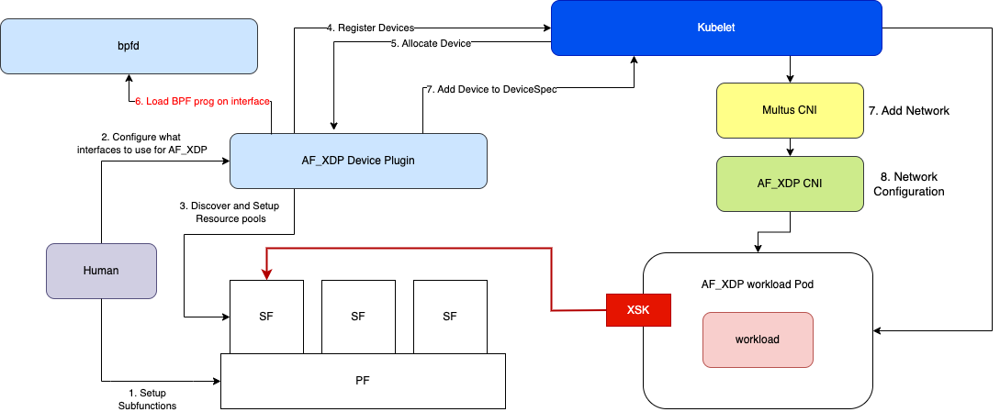
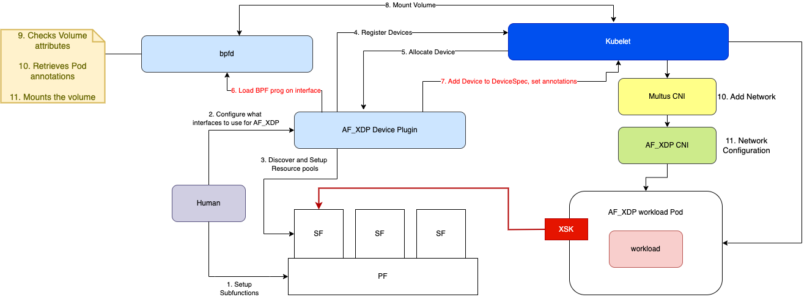

# bpfman's Integration with the AF_XDP Device Plugin and CNI for Kubernetes

[AF_XDP] is an address/socket family that is optimized for high performance packet processing.
It takes advantage of [XDP] (an in Kernel fastpath), which essentially runs an eBPF
program as early as possible on a network driver's receive path, and redirects the
packet to an AF_XDP socket.


AF_XDP sockets (XSKs) are created in Userspace and have a 1:1 mapping with netdev queues.
An XSKMAP is an eBPF map of AF_XDP sockets for a particular netdev. It's a simple key:value
map where the key is the netdev's queue-id and the value is the AF_XDP socket that's attached
to that queue. The eBPF program (at the XDP hook) will leverage the XSKMAP and the XDP_REDIRECT
action to redirect packets to an AF_XDP socket. In the image below the XDP program is redirecting
an incoming packet to the XSK attached to Queue 2.

> **NOTE**: If no XSK is attached to a queue, the XDP program will simply pass the packet to the
Kernel Network Stack.

```sh
+---------------------------------------------------+
|     XSK A      |     XSK B       |      XSK C     |<---+  Userspace
=========================================================|==========
|    Queue 0     |     Queue 1     |     Queue 2    |    |  Kernel space
+---------------------------------------------------+    |
|                  Netdev eth0                      |    |
+---------------------------------------------------+    |
|                            +=============+        |    |
|                            | key |  xsk  |        |    |
|  +---------+               +=============+        |    |
|  |         |               |  0  | xsk A |        |    |
|  |         |               +-------------+        |    |
|  |         |               |  1  | xsk B |        |    |
|  | BPF     |               +-------------+        |    |
|  | prog    |-- redirect -->|  2  | xsk C |-------------+
|  | (XDP    |               +-------------+        |
|  |  HOOK)  |                   xskmap             |
|  |         |                                      |
|  +---------+                                      |
|                                                   |
+---------------------------------------------------+
```

The [AF_XDP Device Plugin and CNI] project provides the Kubernetes components to
provision, advertise and manage AF_XDP networking devices for Kubernetes pods. These
networking devices are typically used as a Secondary networking interface for a pod.
A key goal of this project is to enable pods to run without any special privileges,
without it pods that wish to use AF_XDP will need to run with elevated privileges
in order to manage the eBPF program on the interface. The infrastructure
will have little to no control over what these pods can load. Therefore it's ideal
to leverage a central/infrastructure centric eBPF program management approach.  This blog
will discuss the eBPF program management journey for the AF_XDP Device Plugin and CNI.

[AF_XDP]:https://www.kernel.org/doc/html/next/networking/af_xdp.html
[XDP]: https://docs.cilium.io/en/latest/bpf/progtypes/#xdp
[AF_XDP Device Plugin and CNI]: https://github.com/intel/afxdp-plugins-for-kubernetes

<!-- more -->

## What does the AF_XDP Device Plugin and CNI do?

For pods to create and use AF_XDP sockets on their interfaces, they can either:

1. Create the AF_XDP socket on an interface already plumbed to the Pod (via SR-IOV
   Device Plugin and the Host CNI) --> But this requires CAP_BPF or CAP_SYS_ADMIN
   privileges in order to load the BPF program on the netdev.

   OR

2. Use the AF_XDP Device Plugin (DP) and CNI in order to support a Pod without the
   aforementioned root like privileges.

    > **NOTE**: Prior to kernel 5.19, all BPF sys calls required CAP_BPF, which are
    used to access maps shared between the BPF program and the userspace program.
    In kernel 5.19, a change went in that only requires CAP_BPF for map creation
    (BPF_MAP_CREATE) and loading programs (BPF_PROG_LOAD).

    In this scenario, the ``AF_XDP DP``, will advertise resource pools (of netdevs) to
    ``Kubelet``. When a Pod requests a resource from these pools, ``Kubelet`` will
    `Allocate()` one of these devices through the ``AF_XDP DP``. The ``AF_XDP DP`` will load the eBPF
    program (to redirect packets to an AF_XDP socket) on the allocated device.

    The default behaviour of the ``AF_XDP DP`` (unless otherwise configured) is to take note of the
    XSKMAP File Descriptor (FD) for that netdev. It will also mount a Unix Domain Socket
    (UDS), as a hostpath mount, in the Pod. This UDS will be used by the AF_XDP application
    to perform a handshake with the ``AF_XDP DP`` to retrieve the XSKMAP FD. The application needs
    the XSKMAP FD to "attach" AF_XDP sockets it creates to the netdev queues.

    > **NOTE**: Newer versions of the ``AF_XDP DP`` support eBPF map pinning which eliminate the
    need to perform this (non trivial) handshake with AF_XDP pods. It now mounts the
    pinned XSKMAP into the Pod using a hostpath mount. The downside of this approach is that
    the ``AF_XDP DP`` now needs to manage several eBPF File Systems (BPFFS), one per pod.

    The ``AF_XDP CNI`` (like any CNI) has the task of moving the netdev (with the loaded eBPF
    program) into the Pod namespace. It also does a few other important things:

      - It does not rename the netdev (to allow the DP to avoid IF_INDEX clashes as it manages
         the AF_XDP resource pools).
      - The CNI is also capable of configuring hardware filters on the NIC.
      - Finally, the CNI also unloads the eBPF program from the netdev and clear any hardware
        filters when the Pod is terminated.

    > **NOTE 1**: The ``AF_XDP CNI`` manages the unloading of the eBPF program due to the ``AF_XDP DP``
    not being aware of when a pod terminates (it's only invoked by ``Kubelet`` during pod creation).

    > **NOTE 2**: Prior to bpfman integration, the CNI was extended to signal the AF_XDP DP on pod
    termination (via gRPC) in an effort to support eBPF map pinning directly in the AF_XDP DP. The
    AF_XDP DP was managing BPFFS(es) for map pinning and needed to be signalled to clean them up.

### bpfman Integration

Prior to bpfman integration the AF_XDP Device Plugin and CNI managed the eBPF program
for redirecting incoming packets to AF_XDP sockets, its associated map (XSKMAP), and/or several BPFFS.

#### Integration benefits

So what are the benefits of bpfman integration for the AF_XDP DP and CNI?

- Removes code for loading and managing eBPF from the AF_XDP DP and CNI codebase.

  - This presented a difficulty particularly when trying to find/update appropriate
    base container images to use for the AF_XDP device plugin. Different images
    supported different versions of eBPF management libraries (i.e libbpf or libxdp) which
    forced multiple changes around the loading and attaching of the base eBPF program.

  - Additionally the CNI runs as a binary on the Kubernetes node so we would need to
    statically compile libbpf/libxdp as part of the CNI.

- More diverse XDP program support through bpfman's eBPF Bytecode Image Specification. Not
  only do the AF_XDP eBPF programs no longer need to be stored in the Device Plugin
  itself, but it's now configurable on a per pool basis.

- No longer required to leverage Hostpath volume mounts to mount the AF_XDP maps inside
  a Pod. But rather take advantage of the bpfman CSI support to ensure that maps are
  pinned in the context of the Pod itself and not in a BPFFS on the host (then shared
  to the Pod).

#### AF_XDP Device Plugin eBPF program/map management

The role of the ``AF_XDP DP`` in eBPF program/map management **prior to bpfman integration**:

- Loads the default AF_XDP BPF prog onto the netdev at Pod creation and manages info
regarding the XSKMAP for that netdev.

- Mounts a UDS as a hostpath volume in the Pod OR creates a BPFFS per netdev and pins the
  XSKMAP to it, then mounts this BPFFS as a hostpath volume in the Pod.

- Shares the XSKMAP file descriptor via UDS (involves a handshake with the Pod).

The role of the ``AF_XDP DP`` in eBPF program/map management **after bpfman integration**:

- Uses bpfman's client APIs to load the BPF prog.

- Shares the XSKMAP (that bpfman pinned ) with the Pod as a hostpath volume.

#### AF_XDP CNI eBPF program/map management

The role of the ``AF_XDP CNI`` in eBPF program/map management **prior to bpfman integration**:

- Unloads the eBPF program when a device is returned to the Host network namespace.

The role of the ``AF_XDP CNI`` in eBPF program/map management **after bpfman integration**:

- Uses gRPC to signal to the Device Plugin to request bpfman to unload the eBPF program
  using the client APIs.

## Is there a working example?

The bpfman integration with the AF_XDP Device Plugin and CNI was demo'ed as part
of a series of demos that show the migration of a DPDK application to AF_XDP (without)
any application modification. The demo can be watched below:

[](https://www.youtube.com/embed/wcmSO5HwNJQ)

## AF_XDP DP and CNI's integration with bpfman in images

The following sections will present the evolution of the AF_XDP DP and CNI
from independent eBPF program management to leveraging bpfman to manage eBPF programs on
their behalf.

### AF_XDP DP and CNI managing eBPF programs independently

The following diagram details how the AF_XDP DP and CNI worked prior to bpfman integration.


1. Setup Subfunctions on the network devices (if the are supported/being used).

2. Create an AF_XDP DP and CNI configuration file to setup the device resource pools and
   deploy the DP and CNI.

3. When the AF_XDP DP runs it will discover the netdevs on the host and create the resource pools.

4. The AF_XDP DP registers the resource pools with Kubelet.

5. When a pod (that requests an AF_XDP resource) is started, Kubelet will send an `Allocate()`
   request to the AF_XDP DP. The AF_XDP DP loads the eBPF program on the interface and mounts the
   UDS in the pod and sets some environment variables in the pod using the Downward API.

   > **NOTE**: In the case where eBPF map pinning is used rather than the UDS, the AF_XDP
   DP will create a BPFFS where it pins the XSKMAP and mounts the BPFFS as a hostpath volume
   in the pod.

6. The AF_XDP DP signals success to the Kubelet so that the device is added to the pod.

7. Kubelet triggers multus, which in turn triggers the AF_XDP CNI. The CNI does the relevant network
   configuration and moves the netdev into the pod network namespace.

8. The application in the pod start and initiates a handshake with the AF_XDP DP over the mounted UDS
   to retrieve the XSKMAP FD.

### AF_XDP DP and CNI integrated with bpfman (no csi)

The following diagram details how the AF_XDP DP and CNI worked after bpfman integration.



The main difference here is that when the `Allocate()` request comes in from Kubelet, the AF_XDP
DP uses the bpfman client API to load the eBPF program on the relevant netdev. It takes note of
where bpfman pins the XSKMAP and mounts this directory as a hostpath volume in the pod.

### AF_XDP DP and CNI integrated with bpfman (with csi)

The following diagram details how the AF_XDP DP and CNI will work with bpfman leveraging
the new CSI implementation.



The pod will include a volume definition as follows:

```yaml
   volumes:
   - name: bpf-maps
     csi:
       driver: csi.bpfman.dev
       volumeAttributes:
         csi.bpfman.dev/thru-annotations: true
```

The idea here is when the `Allocate()` request comes in from Kubelet, the AF_XDP
DP uses the bpfman client API to load the eBPF program on the relevant netdev. The
AF_XDP DP will annotate the pod with the XdpProgram name, map and mountpath. When the
bpfman CSI plugin is triggered by Kubelet, it will retrieve the information it needs
from the pod annotations in order to pin the map inside the Pod.
