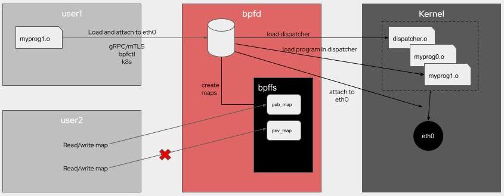

# bpfman: A Novel Way to Manage eBPF

In today's cloud ecosystem, there's a demand for low-level system access to
enable high-performance observability, security, and networking functionality
for applications. Historically these features have been implemented in
[user space], however, the ability to program such functionality into the kernel
itself can provide many benefits including (but not limited to) performance.
Regardless, many Linux users still opt away from in-tree or [kernel
module][kmod] development due to the slow rate of iteration and ensuing large
management burden.  [eBPF] has emerged as a technology in the [Linux
Kernel][Linux] looking to change all that.

<!-- more -->

eBPF is a simple and efficient way to dynamically load programs into the kernel
at runtime, with safety and performance provided by the kernel itself using a
Just-In-Time (JIT) compiler and verification process. There are a wide variety
of program types one can create with eBPF, which include everything from
networking applications to security systems.

However, eBPF is still a fairly nascent technology and it's not all kittens and
rainbows. The process of developing, testing, deploying, and maintaining eBPF
programs is not a road well traveled yet, and the story gets even more
complicated when you want to deploy your programs in a multi-node system, such
as a [Kubernetes] cluster. It was these kinds of problems that motivated the
creation of [bpfman], a system daemon for loading and managing eBPF programs in
both traditional systems and Kubernetes clusters. In this blog post, we'll
discuss the problems bpfman can help solve, and how to deploy and use it.

[user space]:https://en.wikipedia.org/wiki/User_space_and_kernel_space
[kmod]:https://wiki.archlinux.org/title/Kernel_module
[eBPF]:https://en.wikipedia.org/wiki/EBPF
[Linux]:https://kernel.org
[Kubernetes]:https://kubernetes.io
[bpfman]:https://bpfman.io

## Current Challenges with Developing and Deploying eBPF Programs

While some organizations have had success developing, deploying, and maintaining
production software which includes eBPF programs, the barrier to entry is still
very high. 

Following the basic eBPF development workflow, which often involves many hours
trying to interpret and fix mind-bending [eBPF verifier] errors, the process of
deploying a program in testing and staging environments often results in a lot
of custom program loading and management functionality specific to the
application. When moving to production systems in environments like Kubernetes
clusters the operational considerations continue to compound.

Security is another significant challenge, which we will cover in more depth in
a follow-on blog.  However, at a high level, applications that use eBPF
typically load their own eBPF programs, which requires at least CAP_BPF.  Many
BPF programs and attach points require additional capabilities from
CAP_SYS_PTRACE, CAP_NET_ADMIN and even including CAP_SYS_ADMIN.  These
privileges include capabilities that aren’t strictly necessary for eBPF and are
too coarsely grained to be useful.  Since the processes that load eBPF are usually
long-lived and often don’t drop privileges it leaves a wide attack surface.

While it doesn't solve all the ergonomic and maintenance problems associated
with adopting eBPF, [bpfman] does try to address several of these issues --
particularly as it pertains to security and the lifecycle management
of eBPF programs. In the coming sections, we will go into more depth about
what eBPF does, and how it can help reduce the costs
associated with deploying and managing eBPF-powered workloads.

[eBPF verifier]:https://docs.kernel.org/bpf/verifier.html
[bpfman]:https://bpfman.io

## bpfman Overview

The bpfman project provides a software stack that makes it easy to manage the full
lifecycle of eBPF programs.  In particular, it can load, unload, modify, and
monitor eBPF programs on a single host, or across a full Kubernetes cluster. The
key components of bpfman include the bpfman daemon itself which can run
independently on any Linux box, an accompanying Kubernetes Operator designed
to bring first-class support to clusters via Custom Resource Definitions (CRDs), 
and eBPF program packaging.

These components will be covered in more detail in the following sections.

### bpfman Daemon

The bpfman daemon works directly with the operating system to manage eBPF
programs.  It loads, updates, and unloads eBPF programs, pins maps, and provides
visibility into the eBPF programs loaded on a system.  Currently, bpfman fully
supports XDP, TC, Tracepoint, uProbe, and kProbe eBPF programs. In addition,
bpfman can display information about all types of eBPF programs loaded on a system
whether they were loaded by bpfman or some other mechanism. bpfman is developed in
the Rust programming language and uses [Aya], an eBPF library which is also
developed in Rust.

When used on an individual server, bpfman runs as a system daemon, and
applications communicate with it using a gRPC API.  bpfman can also be used via a
command line which in turn uses the gRPC API. The following
is an example of using bpfman to load and attach an xdp program.

    bpfman load-from-image -g GLOBAL_u8=01 -i quay.io/bpfman-bytecode/xdp_pass:latest xdp -i eth0 -p 100

This architecture is depicted in the following diagram.



Using bpfman in this manner significantly improves security because the API is
secured using mTLS, and only bpfman needs the privileges required to load and manage
eBPF programs and maps.

Writing eBPF code is tough enough as it is.  Typically, an eBPF-based
application would need to also implement support for the lifecycle management of
the required eBPF programs.  bpfman does that for you and allows you to focus on
developing your application.

Another key functional advantage that bpfman offers over libbpf or the Cilium
ebpf-go library is support for multiple XDP programs. Standard XDP only allows a
single XDP program on a given interface, while bpfman supports loading multiple
XDP programs on each interface using the [multi-prog] protocol defined in
libxdp. This allows the user to add, delete, update, prioritize, and
re-prioritize the multiple programs on each interface. There is also support to
configure whether the flow of execution should terminate and return or continue
to the next program in the list based on the return value.

While TC natively supports multiple programs on each attach point, it lacks the
controls and flexibility enabled by the multi-prog protocol. bpfman therefore also
supports the same XDP multi-prog solution for TC programs which has the added
benefit of a consistent user experience for both XDP and TC programs.

eBPF programs are also difficult to debug on a system.  The visibility provided
by bpfman can be a key tool in understanding what is deployed and how they may
interact.

[Aya]:https://aya-rs.dev/
[multi-prog]:https://github.com/xdp-project/xdp-tools/blob/master/lib/libxdp/protocol.org


### bpfman Kubernetes Support

The benefits of bpfman are brought to Kubernetes by the bpfman operator.  The bpfman
operator is developed in Go using the Operator SDK framework, so it should be
familiar to most Kubernetes application developers. The bpfman operator deploys a
daemonset, containing both bpfman and the bpfman agent processes on each node.
Rather than making requests directly to bpfman with the gRPC API or CLI as
described above, Kubernetes applications use bpfman custom resource definitions
(CRDs) to make requests to bpfman to load and attach eBPF programs.  bpfman uses two
types of CRDs; Program CRDs for each eBPF program type (referred to as \*Program
CRDs, where \* = Xdp, Tc, etc.) created by the application to express the desired
state of an eBPF program on the cluster, and per node BpfProgram CRDs created by
the bpfman agent to report the current state of the eBPF program on each node.

Using XDP as an example, the application can request that an XDP program be
loaded on multiple nodes using the XdpProgram CRD, which includes the necessary
information such as the bytecode image to load, interface to attach it to, and
priority.  An XdpProgram CRD that would do the same thing as the CLI command
shown above on every node in a cluster is shown below.

```yaml
apiVersion: bpfman.io/v1alpha1
kind: XdpProgram
metadata:
  labels:
    app.kubernetes.io/name: xdpprogram
  name: xdp-pass-all-nodes
spec:
  name: pass
  # Select all nodes
  nodeselector: {}
  interfaceselector:
    primarynodeinterface: true
  priority: 0
  bytecode:
    image:
      url: quay.io/bpfman-bytecode/xdp_pass:latest
  globaldata:
    GLOBAL_u8:
      - 0x01
```

The bpfman agent on each node watches for the \*Program CRDs, and makes calls to
the local instance of bpfman as necessary to ensure that the state on the local
node reflects the state requested in the \*Program CRD.  The bpfman agent on each
node in turn creates and updates a BpfProgram object for the \*Program CRD that
reflects the state of the program on that node and reports the eBPF map
information for the program.  The following is the BpfProgram CRD on one node
for the above XdpProgram CRD.

```bash
kubectl get bpfprograms.bpfman.io xdp-pass-all-nodes-bpfman-deployment-control-plane-eth0 -o yaml
```

```yaml
apiVersion: bpfman.io/v1alpha1
kind: BpfProgram
metadata:
  annotations:
    bpfman.io.xdpprogramcontroller/interface: eth0
  creationTimestamp: "2023-08-29T22:08:12Z"
  finalizers:
  - bpfman.io.xdpprogramcontroller/finalizer
  generation: 1
  labels:
    bpfman.io/ownedByProgram: xdp-pass-all-nodes
    kubernetes.io/hostname: bpfman-deployment-control-plane
  name: xdp-pass-all-nodes-bpfman-deployment-control-plane-eth0
  ownerReferences:
  - apiVersion: bpfman.io/v1alpha1
    blockOwnerDeletion: true
    controller: true
    kind: XdpProgram
    name: xdp-pass-all-nodes
    uid: 838dc2f8-a348-427e-9dc4-f6a6ea621930
  resourceVersion: "2690"
  uid: 5a622961-e5b0-44fe-98af-30756b2d0b62
spec:
  type: xdp
status:
  conditions:
  - lastTransitionTime: "2023-08-29T22:08:14Z"
    message: Successfully loaded bpfProgram
    reason: bpfmanLoaded
    status: "True"
    type: Loaded
```

Finally, the bpfman operator watches for updates to the BpfProgram objects and
reports the global state of each eBPF program.  If the program was successfully
loaded on every selected node, it will report success, otherwise, it will identify
the node(s) that had a problem.  The following is the XdpProgram CRD as updated
by the operator.

```bash
kubectl get xdpprograms.bpfman.io xdp-pass-all-nodes -o yaml
```

```yaml
apiVersion: bpfman.io/v1alpha1
kind: XdpProgram
metadata:
  annotations:
    kubectl.kubernetes.io/last-applied-configuration: |
      {"apiVersion":"bpfman.io/v1alpha1","kind":"XdpProgram","metadata":{"annotations":{},"labels":{"app.kubernetes.io/name":"xdpprogram"},"name":"xdp-pass-all-nodes"},"spec":{"bytecode":{"image":{"url":"quay.io/bpfman-bytecode/xdp_pass:latest"}},"globaldata":{"GLOBAL_u8":[1]},"interfaceselector":{"primarynodeinterface":true},"nodeselector":{},"priority":0,"bpffunctionname":"pass"}}
  creationTimestamp: "2023-08-29T22:08:12Z"
  finalizers:
  - bpfman.io.operator/finalizer
  generation: 2
  labels:
    app.kubernetes.io/name: xdpprogram
  name: xdp-pass-all-nodes
  resourceVersion: "2685"
  uid: 838dc2f8-a348-427e-9dc4-f6a6ea621930
spec:
  bytecode:
    image:
      imagepullpolicy: IfNotPresent
      url: quay.io/bpfman-bytecode/xdp_pass:latest
  globaldata:
    GLOBAL_u8: 0x01
  interfaceselector:
    primarynodeinterface: true
  mapownerselector: {}
  nodeselector: {}
  priority: 0
  proceedon:
  - pass
  - dispatcher_return
  name: pass
status:
  conditions:
  - lastTransitionTime: "2023-08-29T22:08:12Z"
    message: Waiting for Program Object to be reconciled to all nodes
    reason: ProgramsNotYetLoaded
    status: "True"
    type: NotYetLoaded
  - lastTransitionTime: "2023-08-29T22:08:12Z"
    message: bpfProgramReconciliation Succeeded on all nodes
    reason: ReconcileSuccess
    status: "True"
    type: ReconcileSuccess
```
More details about this process can be seen
[here](https://bpfman.io/getting-started/example-bpf-k8s/)

#### eBPF program packaging

The eBPF Bytecode Image specification was created as part of the bpfman project to
define a way to package eBPF bytecode as OCI container images.  Its use was
illustrated in the CLI and `XdpProgram` CRD examples above in which the XDP
program was loaded from `quay.io/bpfman-bytecode/xdp_pass:latest`. The initial
motivation for this image spec was to facilitate the deployment of eBPF programs
in container orchestration systems such as Kubernetes, where it is necessary to
provide a portable way to distribute bytecode to all nodes that need it.
However, bytecode images have proven useful on standalone Linux systems as
well.  When coupled with BPF CO-RE (Compile Once – Run Everywhere), portability
is further enhanced in that applications can use the same bytecode images across
different kernel versions without the need to recompile them for each version.
Another benefit of bytecode containers is image signing.  There is currently no
way to sign and validate raw eBPF bytecode.  However, the bytecode containers
can be signed and validated by bpfman using [sigstore](https://www.sigstore.dev/) to
improve supply chain security.

### Key benefits of bpfman

This section reviews some of the key benefits of bpfman.  These benefits mostly
apply to both standalone and Kubernetes deployments, but we will focus on the
benefits for Kubernetes here.

#### Security

Probably the most compelling benefit of using bpfman is enhanced security. When
using bpfman, only the bpfman daemon, which can be tightly controlled, needs the
privileges required to load eBPF programs, while access to the API can be
controlled via standard RBAC methods on a per-application and per-CRD basis.
Additionally, the signing and validating of bytecode images enables supply chain
security. 

#### Visibility and Debuggability

eBPF programs can interact with each other in unexpected ways.  The
multi-program support described above helps control these interactions by
providing a common mechanism to prioritize and control the flow between the
programs.  However, there can still be problems, and there may be eBPF programs
running on nodes that were loaded by other mechanisms that you don’t even know
about.  bpfman helps here too by reporting all of the eBPF programs running on all
of the nodes in a Kubernetes cluster.

#### Productivity

As described above, managing the lifecycle of eBPF programs is something that
each application currently needs to do on its own.  It is even more complicated
to manage the lifecycle of eBPF programs across a Kubernetes cluster.  bpfman does
this for you so you don't have to.  eBPF bytecode images help here as well by
simplifying the distribution of eBPF bytecode to multiple nodes in a cluster,
and also allowing separate fine-grained versioning control for user space and
kernel space code.
### Demonstration

This demonstration is adapted from the instructions documented by Andrew Stoycos
[here](https://gist.githubusercontent.com/astoycos/c4019178c7cd69b0b5a8d069a26281ee/raw/16ae12f45dc61e01e5c7e90419709096d7944a41/Demo.md).

These instructions use kind and bpfman release v0.2.1. It should also be possible
to run this demo on other environments such as minikube or an actual cluster.

Another option is to [build the code
yourself](https://bpfman.io/getting-started/building-bpfman/) and use [`make
run-on-kind`](https://bpfman.io/getting-started/example-bpf-k8s/) to create the
cluster as is described in the given links.  Then, start with step 5.

#### Run the demo

1\. Create Kind Cluster

```bash
kind create cluster --name=test-bpfman
```

2\. Deploy Cert manager

```bash
kubectl apply -f https://github.com/cert-manager/cert-manager/releases/download/v1.11.0/cert-manager.yaml
```

3\. Deploy bpfman Crds

```bash
kubectl apply -f  https://github.com/bpfman/bpfman/releases/download/v0.2.1/bpfman-crds-install-v0.2.1.yaml
```

4\. Deploy bpfman-operator

```bash
kubectl apply -f https://github.com/bpfman/bpfman/releases/download/v0.2.1/bpfman-operator-install-v0.2.1.yaml
```

5\. Verify the deployment

```bash
kubectl get pods -A
```

```bash
NAMESPACE            NAME                                              READY   STATUS    RESTARTS   AGE
bpfman                 bpfman-daemon-nkzpf                                 2/2     Running   0          28s
bpfman                 bpfman-operator-77d697fdd4-clrf7                    2/2     Running   0          33s
cert-manager         cert-manager-99bb69456-x8n84                      1/1     Running   0          57s
cert-manager         cert-manager-cainjector-ffb4747bb-pt4hr           1/1     Running   0          57s
cert-manager         cert-manager-webhook-545bd5d7d8-z5brw             1/1     Running   0          57s
kube-system          coredns-565d847f94-gjjft                          1/1     Running   0          61s
kube-system          coredns-565d847f94-mf2cq                          1/1     Running   0          61s
kube-system          etcd-test-bpfman-control-plane                      1/1     Running   0          76s
kube-system          kindnet-lv6f9                                     1/1     Running   0          61s
kube-system          kube-apiserver-test-bpfman-control-plane            1/1     Running   0          76s
kube-system          kube-controller-manager-test-bpfman-control-plane   1/1     Running   0          77s
kube-system          kube-proxy-dtmvb                                  1/1     Running   0          61s
kube-system          kube-scheduler-test-bpfman-control-plane            1/1     Running   0          78s
local-path-storage   local-path-provisioner-684f458cdd-8gxxv           1/1     Running   0          61s
```

Note that we have the bpfman-operator, bpf-daemon and cert-manager pods running.

6\. Deploy the XDP counter program and user space application

```bash
kubectl apply -f https://github.com/bpfman/bpfman/releases/download/v0.2.1/go-xdp-counter-install-v0.2.1.yaml
```

7\. Confirm that the programs are loaded

Userspace program:

```bash
kubectl get pods -n go-xdp-counter
```

```bash
NAME                      READY   STATUS              RESTARTS   AGE
go-xdp-counter-ds-9lpgp   0/1     ContainerCreating   0          5s
```

XDP program:

```bash
kubectl get xdpprograms.bpfman.io -o wide
```

```bash
NAME                     BPFFUNCTIONNAME   NODESELECTOR   PRIORITY   INTERFACESELECTOR               PROCEEDON
go-xdp-counter-example   stats             {}             55         {"primarynodeinterface":true}   ["pass","dispatcher_return"]
```

8\. Confirm that the counter program is counting packets.

Notes:

- The counters are updated every 5 seconds, and stats are being collected
for the pod's primary node interface, which may not have a lot of traffic.
However, running the `kubectl` command below generates traffic on that
interface, so run the command a few times and give it a few seconds in between
to confirm whether the counters are incrementing. 
- Replace "go-xdp-counter-ds-9lpgp" with the go-xdp-counter pod name for
your deployment.

```bash
kubectl logs go-xdp-counter-ds-9lpgp -n go-xdp-counter | tail
```

```bash
2023/09/05 16:58:21 1204 packets received
2023/09/05 16:58:21 13741238 bytes received

2023/09/05 16:58:24 1220 packets received
2023/09/05 16:58:24 13744258 bytes received

2023/09/05 16:58:27 1253 packets received
2023/09/05 16:58:27 13750364 bytes received
```

9\. Deploy the `xdp-pass-all-nodes` program with `priority` set to 50 and
  `proceedon` set to `drop` as shown below

```yaml
kubectl apply -f - <<EOF
apiVersion: bpfman.io/v1alpha1
kind: XdpProgram
metadata:
  labels:
    app.kubernetes.io/name: xdpprogram
  name: xdp-pass-all-nodes
spec:
  name: pass
  nodeselector: {}
  interfaceselector:
    primarynodeinterface: true
  priority: 50
  proceedon:
    - drop
  bytecode:
    image:
      url: quay.io/bpfman-bytecode/xdp_pass:latest
EOF
```

10\. Verify both XDP programs are loaded.

```bash
kubectl get xdpprograms.bpfman.io -o wide
```

```bash
NAME                     BPFFUNCTIONNAME   NODESELECTOR   PRIORITY   INTERFACESELECTOR               PROCEEDON
go-xdp-counter-example   stats             {}             55         {"primarynodeinterface":true}   ["pass","dispatcher_return"]
xdp-pass-all-nodes       pass              {}             50         {"primarynodeinterface":true}   ["drop"]
```

The priority setting determines the order in which programs attached to the same
interface are executed by the dispatcher with a lower number being a higher
priority.  The `go-xdp-counter-example` program was loaded at priority 55, so
the `xdp-pass-all-nodes` program will execute before the
`go-xdp-counter-example` program.

The proceedon setting tells the dispatcher whether to "proceed" to execute the
next lower priority program attached to the same interface depending on the
program's return value.  When we set proceedon to drop, execution will proceed
only if the program returns `XDP_DROP`.  However, the `xdp-pass-all-nodes`
program only returns `XDP_PASS`, so execution will terminate after it runs.

Therefore, by loading the `xdp-pass-all-nodes` program in this way, we
should have effectively stopped the `go-xdp-counter-example` program from
running.  Let's confirm that.

11\. Verify that packet counts are not being updated anymore

Run the following command several times

```bash
kubectl logs go-xdp-counter-ds-9lpgp -n go-xdp-counter | tail
```

```bash
2023/09/05 17:10:27 1395 packets received
2023/09/05 17:10:27 13799730 bytes received

2023/09/05 17:10:30 1395 packets received
2023/09/05 17:10:30 13799730 bytes received

2023/09/05 17:10:33 1395 packets received
2023/09/05 17:10:33 13799730 bytes received
```

12\. Now, change the priority of the xdp-pass program to 60

```yaml
kubectl apply -f - <<EOF
apiVersion: bpfman.io/v1alpha1
kind: XdpProgram
metadata:
  labels:
    app.kubernetes.io/name: xdpprogram
  name: xdp-pass-all-nodes
spec:
  name: pass
  # Select all nodes
  nodeselector: {}
  interfaceselector:
    primarynodeinterface: true
  priority: 60
  proceedon:
    - drop
  bytecode:
    image:
      url: quay.io/bpfman-bytecode/xdp_pass:latest
EOF
```

13\. Confirm that packets are being counted again

Run the following command several times

```bash
kubectl logs go-xdp-counter-ds-9lpgp -n go-xdp-counter | tail
```

```bash
2023/09/05 17:12:21 1435 packets received
2023/09/05 17:12:21 13806214 bytes received

2023/09/05 17:12:24 1505 packets received
2023/09/05 17:12:24 13815359 bytes received

2023/09/05 17:12:27 1558 packets received
2023/09/05 17:12:27 13823065 bytes received
```

We can see that the counters are incrementing again.

14\. Clean everything up

Delete the programs

```bash
kubectl delete xdpprogram xdp-pass-all-nodes
kubectl delete -f https://github.com/bpfman/bpfman/releases/download/v0.2.0/go-xdp-counter-install-v0.2.0.yaml
```

And/or, delete the whole kind cluster

```bash
kind delete clusters test-bpfman
```

## Joining the bpfman community

If you're interested in bpfman and want to get involved, you can connect with the
community in multiple ways. If you have some simple questions or need some help
feel free to [start a discussion][bpfman-disc]. If you find an issue, or you want
to request a new feature, please [create an issue][bpfman-iss]. If you want
something a little more synchronous, the project maintains a `#bpfman` channel on
[Kubernetes Slack][k8s-slack] and we have a [weekly community meeting][sync]
where everyone can join and bring topics to discuss about the project. We hope
to see you there!

[bpfman-disc]:https://github.com/bpfman/bpfman/discussions/new/choose
[bpfman-iss]:https://github.com/bpfman/bpfman/issues/new
[k8s-slack]:https://kubernetes.slack.com
[sync]:https://bpfman.io/governance/meetings/
