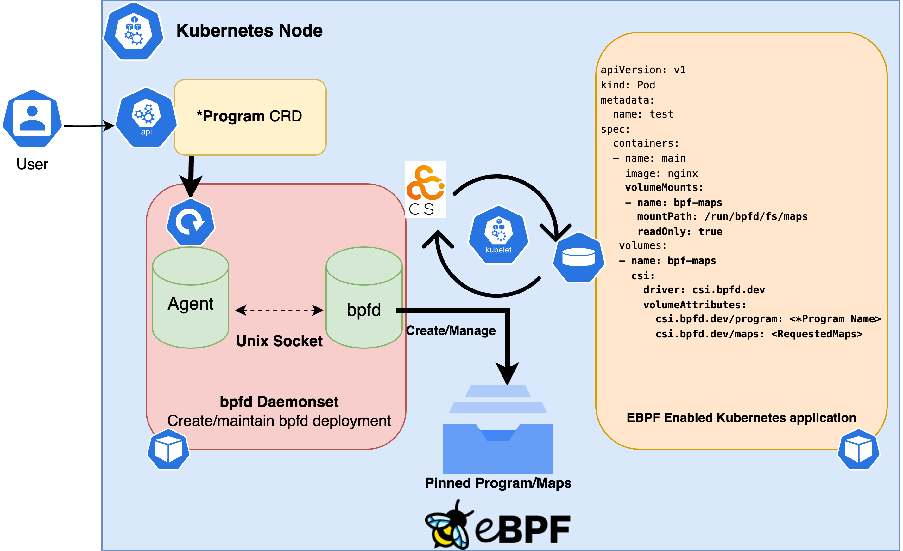

# Developing the bpfd-operator

This doc is intended to give developer level details regarding the layout and design of the bpfd-operator. At its core the operator was implemented using the [operator-sdk framework](https://sdk.operatorframework.io/) which make those docs another good resource if anything is missed here.

## High level design overview

This repository houses two main processes, the `bpfd-agent` and the `bpfd-operator` along with CRD api definitions for `BpfProgram` and `*Program` Objects. The following diagram depicts how all these components work together to create a functioning operator.



## Building and deploying

For building and deploying the bpfd-operator simply see the attached `Make help`
output.

```bash
 make help

Usage:
  make <target>

General
  help             Display this help.

Local Dependencies
  kustomize        Download kustomize locally if necessary.
  cm-verifier      Download cm-verifier locally if necessary.
  controller-gen   Download controller-gen locally if necessary.
  envtest          Download envtest-setup locally if necessary.
  opm              Download opm locally if necessary.

Development
  manifests        Generate WebhookConfiguration, ClusterRole and CustomResourceDefinition objects.
  generate         Generate ALL auto-generated code.
  generate-register  Generate register code see all `zz_generated.register.go` files.
  generate-deepcopy  Generate code containing DeepCopy, DeepCopyInto, and DeepCopyObject method implementations see all `zz_generated.register.go` files.
  generate-typed-clients  Generate typed client code
  generate-typed-listers  Generate typed listers code
  generate-typed-informers  Generate typed informers code
  fmt              Run go fmt against code.
  verify           Verify all the autogenerated code
  lint             Run golang-ci linter
  test             Run Unit tests.
  test-integration  Run Integration tests.
  bundle           Generate bundle manifests and metadata, then validate generated files.

Build
  build            Build bpfd-operator and bpfd-agent binaries.
  build-images     Build bpfd, bpfd-agent, and bpfd-operator images.
  push-images      Push bpfd, bpfd-agent, bpfd-operator images.
  load-images-kind  Load bpfd, bpfd-agent, and bpfd-operator images into the running local kind devel cluster.
  bundle-build     Build the bundle image.
  bundle-push      Push the bundle image.
  catalog-build    Build a catalog image.
  catalog-push     Push a catalog image.

CRD Deployment
  install          Install CRDs into the K8s cluster specified in ~/.kube/config.
  uninstall        Uninstall CRDs from the K8s cluster specified in ~/.kube/config. Call with ignore-not-found=true to ignore resource not found errors during deletion.

Deployment Dependencies
  deploy-certmanager  Deploy certmanager to the cluster specified in ~/.kube/config.
  undeploy-certmanager  Undeploy certmanager from the cluster specified in ~/.kube/config. Call with ignore-not-found=true to ignore resource not found errors during deletion.

Vanilla K8s Deployment
  setup-kind       Setup Kind cluster with certmanager ready for bpfd deployment
  deploy           Deploy bpfd-operator to the K8s cluster specified in ~/.kube/config.
  undeploy         Undeploy bpfd-operator from the K8s cluster specified in ~/.kube/config. Call with ignore-not-found=true to ignore resource not found errors during deletion.
  kind-reload-images  Reload locally build images into a kind cluster and restart the ds and deployment so they're picked up.
  run-on-kind      Kind Deploy runs the bpfd-operator on a local kind cluster using local builds of bpfd, bpfd-agent, and bpfd-operator

Openshift Deployment
  deploy-openshift  Deploy bpfd-operator to the Openshift cluster specified in ~/.kube/config.
  undeploy-openshift  Undeploy bpfd-operator from the Openshift cluster specified in ~/.kube/config. Call with ignore-not-found=true to ignore resource not found errors during deletion.
```

## Running Locally in KIND

To run locally in a kind cluster with an up to date build simply run:

```bash
make run on kind
```

The container images used for `bpfd`,`bpfd-agent`, and `bpfd-operator` can also be manually configured, by default local image builds will be used for the kind deployment.

```bash
BPFD_IMG=<your/image/url> BPFD_AGENT_IMG=<your/image/url> BPFD_OPERATOR_IMG=<your/image/url> make run-on-kind
```

Then rebuild and load a fresh build run:

```bash
make kind-reload-images
```

Which will rebuild the bpfd-operator, bpfd-agent, and bpfd images and load them into the kind cluster.

## Testing Locally

To run all of the **Unit Tests** defined in the bpfd-operator controller code simply run `make test`.

To run **Integration Tests** locally:

1. Build the images locally with the `int-test` tag.

```bash
    BPFD_AGENT_IMG=quay.io/bpfd/bpfd-agent:int-test BPFD_IMG=quay.io/bpfd/bpfd:int-test BPFD_OPERATOR_IMG=quay.io/bpfd/bpfd-operator:int-test make build-images
```

2. Run the integration test suite.

```bash
    BPFD_AGENT_IMG=quay.io/bpfd/bpfd-agent:int-test BPFD_IMG=quay.io/bpfd/bpfd:int-test BPFD_OPERATOR_IMG=quay.io/bpfd/bpfd-operator:int-test make test-integration
```

Additionally the integration test can be configured with the following environment variables.

`KEEP_TEST_CLUSTER`: If set to `true` the test cluster will not be torn down after the integration test suite completes.

`USE_EXISTING_KIND_CLUSTER`: If this is set to the name of the existing kind cluster the integration test suite will use that cluster instead of creating a new one.

## Project Layout

The bpfd-operator project layout is guided by the recommendations from both the [operator-sdk framework](https://sdk.operatorframework.io/docs/building-operators/golang/tutorial/#project-layout) and the [standard golang project-layout](https://github.com/golang-standards/project-layout). The following is a brief description of the main directories and their contents.

**NOTE: Bolded directories contain auto-generated code**


- **`/apis`**: Contains the K8s CRD api definitions(`*_tyeps.go`) for each version along with the autogenerated register and deepcopy methods(`zz_generated.deepcopy.go` and `zz_generate_register.go`).
- `/bundle`: Contains the OLM bundle manifests and metadata for the operator. More details can be found in the operator-sdk documentation.
- `/cmd`: Contains the main entry-points for the operator and bpfd-agent processes. 
- `/config`: Contains the configuration files for launching the bpfd-operator on a cluster.
    - `/bpfd-deployment`: Contains static deployment yamls for the bpfd-daemon, this includes two containers, one for `bpfd` and the other for the `bpfd-agent`. This DaemonSet yaml is NOT deployed statically by kustomize, instead it's statically copied into the operator image which is then responsible for deploying and configuring the bpfd-daemon DaemonSet. Lastly, this directory also contains the default config used to configure the bpfd-daemon, along with the cert-manager certificates used to encrypt communication between the bpfd-agent and bpfd.
    - `/bpfd-operator-deployment:` Contains the static deployment yaml for the bpfd-operator. This is deployed statically by kustomize.
    - `/cert-manager`: Contains the cert-manager manifests used to deploy cert-manager to a cluster. Specifically it just contains a symlink to it's manifests locking us into a specific version.
    - `/crd`: Contains the CRD manifests for all of the bpfd-operator APIs.
        - **`/bases`**: Is where the actual CRD definitions are stored. These definitions are auto-generated by [controller-gen](https://book.kubebuilder.io/reference/controller-gen.html).
    - `/default`: Contains the default deployment configuration for the bpfd-operator.
    - `/manifests`: Contains the bases for generating OLM manifests.
    - `/openshift`: Contains the Openshift specific deployment configuration for the bpfd-operator.
    - `/prometheus`: Contains the prometheus manifests used to deploy prometheus to a cluster. At the time of writing this the bpfd-operator is NOT exposing any metrics to prometheus, but this is a future goal.
    - **`/rbac`**: Contains rbac yamls for getting bpfd and the bpfd-operator up and running on kubernetes.
        **`/bpfd-agent`**: Contains the rbac yamls for the bpfd-agent. They are automatically generated by kubebuilder via build tags in the bpfd-agent
        controller code.
        **`/bpfd-operator`**: Contains the rbac yamls for the bpfd-operator. They are automatically generated by kubebuilder via build tags in the bpfd-operator controller code.
    - `/samples`: Contains sample CR definitions that can be deployed by users for each of our supported APIs.
    - `/scorecard`: Contains the scorecard manifests used to deploy scorecard to a cluster. At the time of writing this the bpfd-operator is NOT running any scorecard tests.
    - `/test`: Contains the test manifests used to deploy the bpfd-operator to a kind cluster for integration testing.
- `/controllers`: Contains the controller implementations for all of the bpfd-operator APIs. Each controller is responsible for reconciling the state of the cluster with the desired state defined by the user. This is where the source of truth for the autogenerated-rbac can be found, keep an eye out for `//+kubebuilder:rbac:groups=bpfd.io` comment tags.
    - `/bpfdagent`: Contains the controller implementations which reconcile user created `*Program` types to multiple `BpfProgram` objects.
    - `/bpfdoperator`: Contains the controller implementations which reconcile global `BpfProgram` object state back to the user by ensuring the user created `*Program` objects are reporting the correct status.
- `/hack`: Contains any scripts+static files used by the bpfd-operator to facilitate development.
- `/internal`: Contains all private library code and is used by the bpfd-operator and bpfd-agent controllers.
- **`/pkg`**: Contains all public library code this is consumed externally and internally.
    - **`/client`**: Contains the autogenerated clientset, informers and listers for all of the bpfd-operator APIs. These are autogenerated by the [k8s.io/code-generator project](https://github.com/kubernetes/code-generator), and can be consumed by users wishing to programmatically interact with bpfd specific APIs.
    - `/helpers`: Contains helper functions which can be consumed by users wishing to programmatically interact with bpfd specific APIs.
- `/test/integration`: Contains integration tests for the bpfd-operator. These tests are run against a kind cluster and are responsible for testing the bpfd-operator in a real cluster environment. It uses the [kubernetes-testing-framework project](https://github.com/Kong/kubernetes-testing-framework) to programmatically spin-up all of the required infrastructure for our unit tests.
- `Makefile`: Contains all of the make targets used to build, test, and generate code used by the bpfd-operator.
