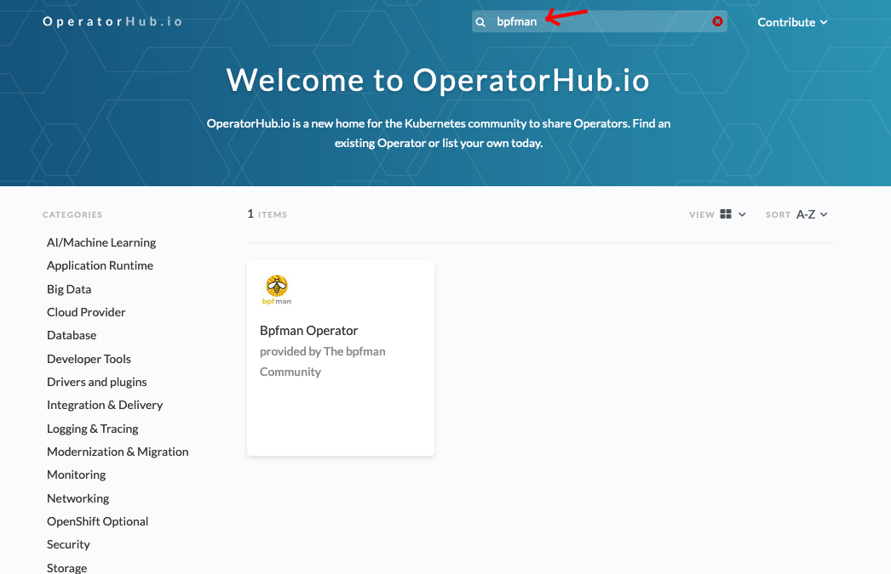
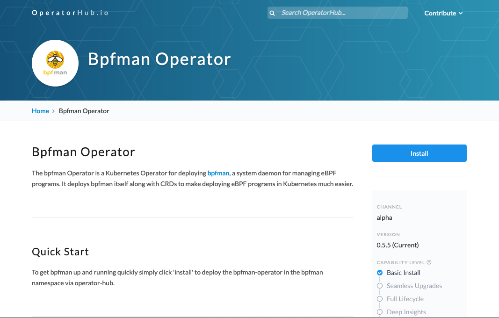
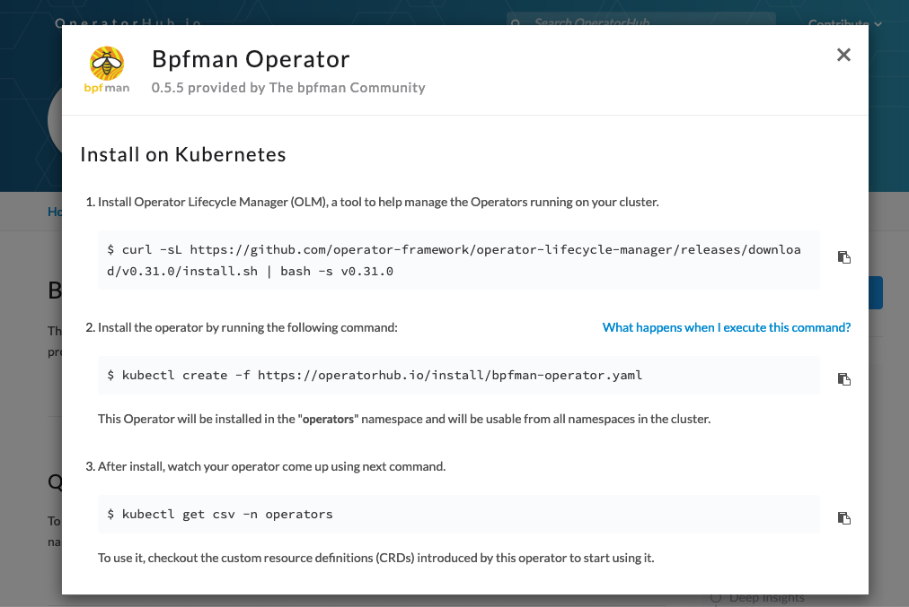
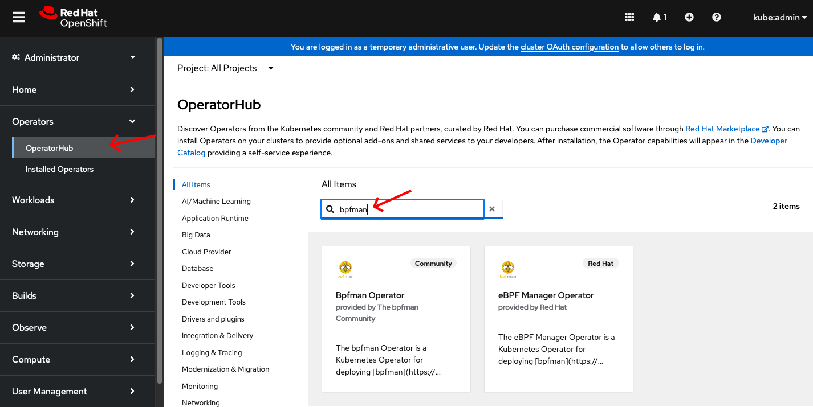
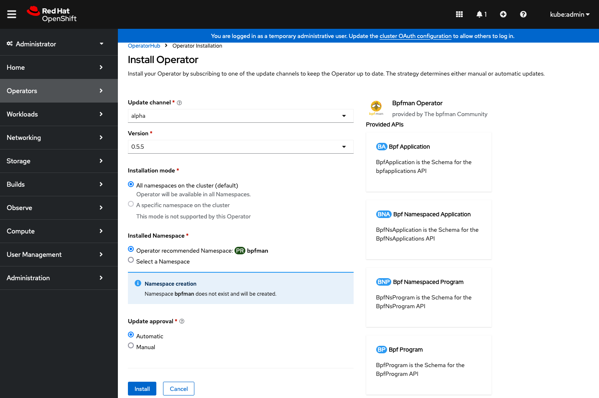
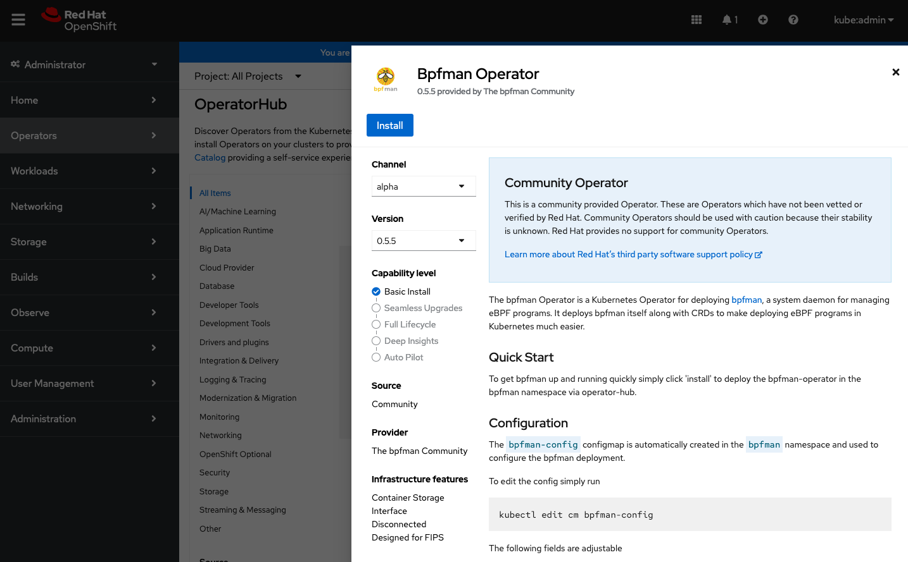
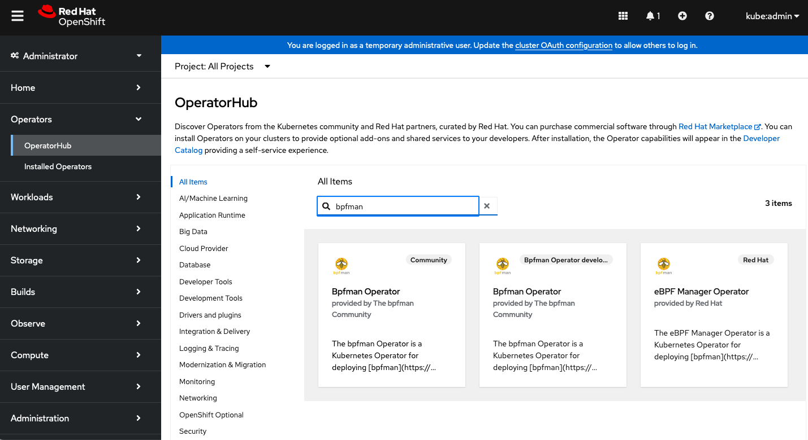

# Developing the bpfman-operator

This section is intended to give developer level details regarding the layout and design of the bpfman-operator.
At its core the operator was implemented using the [operator-sdk framework](https://sdk.operatorframework.io/),
which make those docs another good resource if anything is missed here.

## High level design overview

This repository houses two main processes, the `bpfman-agent` and the `bpfman-operator`, along with CRD api definitions
for `BpfProgram` and `*Program` Objects.
The following diagram depicts how all these components work together to create a functioning operator.


The `bpfman-operator` is running as a Deployment with a ReplicaSet of one.
It runs on the control plane and is composed of the containers `bpfman-operator` and
`kube-rbac-proxy`.
The operator is responsible for launching the bpfman Daemonset, which runs on every node.
The bpfman Daemonset is composed of the containers `bpfman`, `bpfman-agent`, and `node-driver-registrar`.

## Building and Deploying

For building and deploying the bpfman-operator, simply see the attached `make help`
output.

```bash
$ make help

Usage:
  make <target>

General
  help             Display this help.

Local Dependencies
  kustomize        Download kustomize locally if necessary.
  controller-gen   Download controller-gen locally if necessary.
  register-gen     Download register-gen locally if necessary.
  informer-gen     Download informer-gen locally if necessary.
  lister-gen       Download lister-gen locally if necessary.
  client-gen       Download client-gen locally if necessary.
  envtest          Download envtest-setup locally if necessary.
  opm              Download opm locally if necessary.

Development
  manifests        Generate WebhookConfiguration, ClusterRole and CustomResourceDefinition objects.
  generate         Generate ALL auto-generated code.
  generate-register  Generate register code see all `zz_generated.register.go` files.
  generate-deepcopy  Generate code containing DeepCopy, DeepCopyInto, and DeepCopyObject method implementations see all `zz_generated.register.go` files.
  generate-typed-clients  Generate typed client code
  generate-typed-listers  Generate typed listers code
  generate-typed-informers  Generate typed informers code
  vendors          Refresh vendors directory.
  fmt              Run go fmt against code.
  verify           Verify all the autogenerated code
  lint             Run linter (golangci-lint).
  test             Run Unit tests.
  test-integration  Run Integration tests.
  bundle           Generate bundle manifests and metadata, then validate generated files.
  build-release-yamls  Generate the crd install bundle for a specific release version.

Build
  build            Build bpfman-operator and bpfman-agent binaries.
  build-images     Build bpfman-agent and bpfman-operator images.
  build-operator-image  Build bpfman-operator image.
  build-agent-image  Build bpfman-agent image.
  push-images      Push bpfman-agent and bpfman-operator images.
  load-images-kind  Load bpfman-agent, and bpfman-operator images into the running local kind devel cluster.
  bundle-build     Build the bundle image.
  bundle-push      Push the bundle image.
  catalog-build    Build a catalog image.
  catalog-push     Push a catalog image.

CRD Deployment
  install          Install CRDs into the K8s cluster specified in ~/.kube/config.
  uninstall        Uninstall CRDs from the K8s cluster specified in ~/.kube/config. Call with ignore-not-found=true to ignore resource not found errors during deletion.

Vanilla K8s Deployment
  setup-kind       Setup Kind cluster
  destroy-kind     Destroy Kind cluster
  deploy           Deploy bpfman-operator to the K8s cluster specified in ~/.kube/config with the csi driver initialized.
  undeploy         Undeploy bpfman-operator from the K8s cluster specified in ~/.kube/config. Call with ignore-not-found=true to ignore resource not found errors during deletion.
  kind-reload-images  Reload locally build images into a kind cluster and restart the ds and deployment so they're picked up.
  run-on-kind      Kind Deploy runs the bpfman-operator on a local kind cluster using local builds of bpfman, bpfman-agent, and bpfman-operator

Openshift Deployment
  deploy-openshift  Deploy bpfman-operator to the Openshift cluster specified in ~/.kube/config.
  undeploy-openshift  Undeploy bpfman-operator from the Openshift cluster specified in ~/.kube/config. Call with ignore-not-found=true to ignore resource not found errors during deletion.
  catalog-deploy   Deploy a catalog image.
  catalog-undeploy  Undeploy a catalog image.
```

### Project Layout

The bpfman-operator project layout is guided by the recommendations from both the
[operator-sdk framework](https://sdk.operatorframework.io/docs/building-operators/golang/tutorial/#project-layout)
and the [standard golang project-layout](https://github.com/golang-standards/project-layout).
The following is a brief description of the main directories under `bpfman-operator/` and their contents.

**NOTE: Bolded directories contain auto-generated code**

- `apis/v1alpha1/*_types.go`: Contains the K8s CRD api definitions (`*_types.go`) for each program type.
- **apis/v1alpha1/zz_generated.*.go**: Contains the auto-generated register (`zz_generate.register.go`)
  and deep copy (`zz_generated.deepcopy.go`) methods.
- **bundle/**: Contains the bundle manifests and metadata for the operator.
  More details can be found in the operator-sdk documentation.
- `cmd/`: Contains the main entry-points for the bpfman-operator and bpfman-agent processes.
- `config/`: Contains the configuration files for launching the bpfman-operator on a cluster.
    - `bpfman-deployment/`: Contains static deployment yamls for the bpfman-daemon.
      This includes two containers, one for `bpfman` and the other for the `bpfman-agent`.
      This DaemonSet yaml is NOT deployed statically by kustomize, instead it's statically copied into the operator
      image which is then responsible for deploying and configuring the bpfman-daemon DaemonSet.
      Lastly, this directory also contains the default config used to configure the bpfman-daemon, along with the
      cert-manager certificates used to encrypt communication between the bpfman-agent and bpfman.
    - `bpfman-operator-deployment/`: Contains the static deployment yaml for the bpfman-operator.
      This is deployed statically by kustomize.
    - `crd/`: Contains the CRD manifests for all of the bpfman-operator APIs.
        - **bases/**: This is where the actual CRD definitions are stored.
          These definitions are auto-generated by [controller-gen](https://book.kubebuilder.io/reference/controller-gen.html).
        - `patches/`: Contains kustomize patch files for each Program Type, which enables a conversion webhook for
           the CRD and adds a directive for certmanager to inject CA into the CRD.
    - `default/`: Contains the default deployment configuration for the bpfman-operator.
    - `manifests/`: Contains the bases for generating OLM manifests.
    - `openshift/`: Contains the Openshift specific deployment configuration for the bpfman-operator.
    - `prometheus/`: Contains the prometheus manifests used to deploy Prometheus to a cluster.
      At the time of writing this the bpfman-operator is NOT exposing any metrics to prometheus, but this is a future goal.
    - **rbac/**: Contains RBAC yamls for getting bpfman and the bpfman-operator up and running on Kubernetes.
        - **bpfman-agent/**: Contains the RBAC yamls for the bpfman-agent.
        They are automatically generated by kubebuilder via build tags in the bpfman-agent controller code.
        - **bpfman-operator/**: Contains the RBAC yamls for the bpfman-operator.
        They are automatically generated by kubebuilder via build tags in the bpfman-operator controller code.
    - `samples/`: Contains CRD samples that can be deployed by users for each of our supported APIs.
    - `scorecard/`: Contains the scorecard manifests used to deploy scorecard to a cluster. At the time of writing
      this the bpfman-operator is NOT running any scorecard tests.
    - `test/`: Contains the test manifests used to deploy the bpfman-operator to a kind cluster for integration testing.
- `controllers/`: Contains the controller implementations for all of the bpfman-operator APIs.
  Each controller is responsible for reconciling the state of the cluster with the desired state defined by the user.
  This is where the source of truth for the auto-generated RBAC can be found, keep an eye out for
  `//+kubebuilder:rbac:groups=bpfman.io` comment tags.
    - `bpfmanagent/`: Contains the controller implementations which reconcile user created `*Program` types to multiple
      `BpfProgram` objects.
    - `bpfmanoperator/`: Contains the controller implementations which reconcile global `BpfProgram` object state back to
      the user by ensuring the user created `*Program` objects are reporting the correct status.
- `hack/`: Contains any scripts+static files used by the bpfman-operator to facilitate development.
- `internal/`: Contains all private library code and is used by the bpfman-operator and bpfman-agent controllers.
- `pkg/`: Contains all public library code this is consumed externally and internally.
    - **client/**: Contains the autogenerated clientset, informers and listers for all of the bpfman-operator APIs.
      These are autogenerated by the [k8s.io/code-generator project](https://github.com/kubernetes/code-generator),
      and can be consumed by users wishing to programmatically interact with bpfman specific APIs.
    - `helpers/`: Contains helper functions which can be consumed by users wishing to programmatically interact with
      bpfman specific APIs.
- `test/integration/`: Contains integration tests for the bpfman-operator.
  These tests are run against a kind cluster and are responsible for testing the bpfman-operator in a real cluster
  environment.
  It uses the [kubernetes-testing-framework project](https://github.com/Kong/kubernetes-testing-framework) to
  programmatically spin-up all of the required infrastructure for our unit tests.
- `Makefile`: Contains all of the make targets used to build, test, and generate code used by the bpfman-operator.

### RPC Protobuf Generation

Technically part of the `bpfman` API, the RPC Protobufs are usually not coded until a bpfman feature is
integrated into the `bpfman-operator` and `bpfman-agent` code.
To modify the RPC Protobuf definition, edit
[proto/bpfman.proto](https://github.com/bpfman/bpfman/blob/main/proto/bpfman.proto).
Then to generate the protobufs from the updated RPC Protobuf definitions:

```bash
cd bpfman/
cargo xtask build-proto
```

This will generate:

- **bpfman-api/src/bpfman.v1.rs**: Generated Rust Protobuf source code.
- **clients/gobpfman/v1/**: Directory that contains the generated Go Client code for interacting
  with bpfman over RPC from a Go application.

When editing 
[proto/bpfman.proto](https://github.com/bpfman/bpfman/blob/main/proto/bpfman.proto),
follow best practices describe in
[Proto Best Practices](https://protobuf.dev/programming-guides/dos-donts/).

!!! Note
    `cargo xtask build-proto` also pulls in 
    [proto/csi.proto](https://github.com/bpfman/bpfman/blob/main/proto/csi.proto) (which is in the
    same directory as
    [proto/bpfman.proto](https://github.com/bpfman/bpfman/blob/main/proto/bpfman.proto)).
    [proto/csi.proto](https://github.com/bpfman/bpfman/blob/main/proto/csi.proto) is taken from
    [container-storage-interface/spec/csi.proto](https://github.com/container-storage-interface/spec/blob/master/csi.proto).
    See [container-storage-interface/spec/spec.md](https://github.com/container-storage-interface/spec/blob/master/spec.md)
    for more details.

### Generated Files and Adding New Program Type

The [operator-sdk framework](https://sdk.operatorframework.io/docs/building-operators/golang/tutorial/#project-layout)
will generate multiple categories of files (Custom Resource Definitions (CRD), RBAC Role and ClusterRole, Webhook Configuration,
typed client, listeners and informers code, etc).
When adding a new Program Type or if any of these files are modified, then the auto-generated files must be regenerated:

* [bpfman-operator/apis/v1alpha1/*_types.go](https://github.com/bpfman/bpfman-operator/tree/main/apis/v1alpha1):
  Contains the K8s CRD api definitions (`*_types.go`) for each program type.
  When adding a new Program Type, add a file here for the new type.
* [bpfman-operator/config/crd/kustomization.yaml](https://github.com/bpfman/bpfman-operator/blob/main/config/crd/kustomization.yaml):
  This file specifies the output location for the generated yaml files that define the Custom Resource
  Definitions (CRDs).
  This file must be updated when a new CRD needs to be generated.
* [bpfman-operator/config/crd/patches/](https://github.com/bpfman/bpfman-operator/tree/main/config/crd/patches):
  There is a `cainjection_in_*programs.yaml` and `webhook_in_*programs.yaml` file for each Program Type
  in this directory.
  When adding a new Program Type, add files here for the new type.
* [bpfman-operator/config/manifests/bases/bpfman-operator.clusterserviceversion.yaml](https://github.com/bpfman/bpfman-operator/blob/main/config/manifests/bases/bpfman-operator.clusterserviceversion.yaml):
  This file has a list of bpfman Custom Resource Definitions.
  When adding a new Program Type, an entry for the new type must be added to this file.
* [bpfman-operator/config/samples/bpfman.io_v1alpha1_\*_\*program.yaml](https://github.com/bpfman/bpfman-operator/blob/main/config/manifests/bases/bpfman-operator.clusterserviceversion.yaml):
  Contains a sample of how to deploy each Program Type.
  When adding a new Program Type, add a file here for the new type.
* [bpfman-operator/controllers/bpfman-agent/*_program.go](https://github.com/bpfman/bpfman-operator/tree/main/controllers/bpfman-agent):
  Contains the Program Type specific reconciler for the bpfman-agent.
  If the `//+kubebuilder:rbac` directives are added or changed, the associated `role.yaml` must be regenerated.
  When adding a new Program Type, add a file here for the new type.
* [bpfman-operator/controllers/bpfman-agent/common.go](https://github.com/bpfman/bpfman-operator/blob/main/controllers/bpfman-agent/common.go):
  Contains the common reconciler code for the bpfman-agent.
  If the `//+kubebuilder:rbac` directives are added or changed, the associated `role.yaml` must be regenerated.
  When adding a new Program Type, `//+kubebuilder:rbac` directives need to be added for the new type.
* [bpfman-operator/controllers/bpfman-operator/*_program.go](https://github.com/bpfman/bpfman-operator/tree/main/controllers/bpfman-operator):
  Contains the Program Type specific reconciler for the bpfman-operator.
  If the `//+kubebuilder:rbac` directives are added or changed, the associated `role.yaml` must be regenerated.
  When adding a new Program Type, add a file here for the new type.
* [bpfman-operator/controllers/bpfman-operator/common.go](https://github.com/bpfman/bpfman-operator/blob/main/controllers/bpfman-operator/common.go):
  Contains the common reconciler code for the bpfman-operator.
  If the `//+kubebuilder:rbac` directives are added or changed, the associated `role.yaml` must be regenerated.
  When adding a new Program Type, `//+kubebuilder:rbac` directives need to be added for the new type.

Then regenerate the generated files using:

```bash
cd bpfman-operator/
make generate
```

There are commands to generate each sub-category if needed.
See `make help` to list all the generate commands.

This command will generate the following files:

* [bpfman-operator/apis/v1alpha1/zz_generate.register.go](https://github.com/bpfman/bpfman-operator/tree/main/apis/v1alpha1):
  Contains the auto-generated register methods for all the Program Types.
* [bpfman-operator/apis/v1alpha1/zz_generated.deepcopy.go](https://github.com/bpfman/bpfman-operator/tree/main/apis/v1alpha1):
  Contains the deep copy methods for all the Program Types.
* [bpfman-operator/config/crd/bases/bpfman.io_*programs.yaml](https://github.com/bpfman/bpfman-operator/tree/main/config/crd/bases):
  Contains the yaml files that the define the Custom Resource Definitions (CRDs).
* [bpfman-operator/config/rbac/bpfman-agent/role.yaml](https://github.com/bpfman/bpfman-operator/blob/main/config/rbac/bpfman-agent/role.yaml):
  Contains the `Role` and `ClusterRole` definitions for bpfman-agent.
  Controls the bpfman-agent access rights to each of the Program Type CRDs.
  Generated from the `//+kubebuilder:rbac` directives in source code.
* [bpfman-operator/config/rbac/bpfman-operator/role.yaml](https://github.com/bpfman/bpfman-operator/blob/main/config/rbac/bpfman-operator/role.yaml):
  Contains the `Role` and `ClusterRole` definitions for bpfman-operator.
  Controls the bpfman-operator access rights to each of the Program Type CRDs.
  Generated from the `//+kubebuilder:rbac` directives in source code.
* [bpfman-operator/pkg/client/*](https://github.com/bpfman/bpfman-operator/tree/main/pkg/client):
  Everything under this directory is generated.
  Contains client Golang code to enable applications to easily integrate with bpfman.

Then regenerate the generated bundle files using (Note: `make bundle` calls `make generate`):

```bash
cd bpfman-operator/
make bundle
```

This command will generate the following files:

* [bpfman-operator/bundle/*](https://github.com/bpfman/bpfman-operator/tree/main/bundle):
  Contains the bundle manifests and metadata for the operator.
  This bundle is used to deploy the CRDs in a cluster.
  More details can be found in the operator-sdk documentation. 

### Building

To run in Kubernetes, bpfman components need to be containerized.
However, building container images can take longer than just building the code.
During development, it may be quicker to find and fix build errors by just building the code.
To build the code:

```bash
cd bpfman-operator/
make build
```

To build the container images, run the following command:

```bash
cd bpfman-operator/
make build-images
```

If the `make build` command is skipped above, the code will be built in the build-images command.
If the `make build` command is run, the built code will be leveraged in this step.
This command generates the following local images:

```bash
docker images
REPOSITORY                       TAG      IMAGE ID       CREATED          SIZE
quay.io/bpfman/bpfman            latest   69df038ccea3   43 seconds ago   515MB
quay.io/bpfman/bpfman-agent      latest   f6af33c5925b   2 minutes ago    464MB
quay.io/bpfman/bpfman-operator   latest   4fe444b7abf1   2 minutes ago    141MB
:
```

When running in KIND (see below), the local images will be loaded into the KIND
environment.
There may be times when the image need to be built and pushed to a remote repository
like quay.io so they can be shared or loaded in a remote cluster.
The `Makefile` uses the following variables to manage the location of the built images:

* **BPFMAN_IMG:** The bpfman image is not built from the bpfman operator repository, but the
  bpfman operator yaml files control which image is loaded in the cluster.
  Use this variable to manage the bpfman image loaded by the bpfman-operator.
  If not specified, defaults to `quay.io/bpfman/bpfman:latest`.
* **BPFMAN_AGENT_IMG:** The bpfman agent image.
  If not specified, defaults to `quay.io/bpfman/bpfman-agent:latest`.
* **BPFMAN_OPERATOR_IMG:** The bpfman operator image.
  If not specified, defaults to `quay.io/bpfman/bpfman-operatorman:latest`.

To build the bpfman operator images with custom image locations, use something similar to:

```bash
cd bpfman-operator/
BPFMAN_AGENT_IMG=quay.io/$QUAY_USER/bpfman:test \
BPFMAN_AGENT_IMG=quay.io/$QUAY_USER/bpfman-agent:test \
BPFMAN_OPERATOR_IMG=quay.io/$QUAY_USER/bpfman-operator:test \
make build-images
```

## Running Locally in KIND

[Deploying the bpfman-operator](../getting-started/operator-quick-start.md) goes into more detail on ways to
launch bpfman in a Kubernetes cluster.
To run locally in a Kind cluster with an up to date build simply run:

```bash
cd bpfman-operator/
make run-on-kind
```

> **NOTE:** By default, bpfman-operator deploys bpfman with CSI enabled.
CSI requires Kubernetes v1.26 due to a PR
([kubernetes/kubernetes#112597](https://github.com/kubernetes/kubernetes/pull/112597))
that addresses a gRPC Protocol Error that was seen in the CSI client code and it doesn't appear to have
been backported.
It is recommended to install kind v0.20.0 or later.

The `make run-on-kind` will run the `make build-images` if the images do not exist or need updating.

Then rebuild and load a fresh build run:

```bash
cd bpfman-operator/
make build-images
make kind-reload-images
```

Which will rebuild the bpfman-operator and bpfman-agent images, and load them into the kind cluster.

By default, the `make run-on-kind` uses the local images described above.
The container images used for `bpfman`, `bpfman-agent`, and `bpfman-operator` can also be manually configured:

```bash
BPFMAN_IMG=<your/image/url> BPFMAN_AGENT_IMG=<your/image/url> BPFMAN_OPERATOR_IMG=<your/image/url> make run-on-kind
```

## Testing Locally

See [Kubernetes Operator Tests](https://bpfman.io/main/developer-guide/testing/#kubernetes-operator-tests). 

## Deploy To Existing Cluster

There are several ways to deploy bpfman to an existing Kubernetes cluster.
The cluster needs to be up and running and specified in ~/.kube/config file.
  
* **OperatorHub:** bpfman can be installed in a cluster from either the community OperatorHub
  ([OperatorHub.io](https://operatorhub.io/)) or to an OpenShift Cluster via the OpenShift
  Console and the builtin Console OperatorHub.
  This is the recommended method for installing the latest release of bpfman/bpfman-operator.

* **Custom OpenShift Console OperatorHub Bundle:** Custom bpfman/bpfman-operator image can be
  installed in via OpenShift Console OperatorHub.
  This is the recommended method when developing in bpfman/bpfman-operator, building custom images,
  and needing to test from OpenShift Console OperatorHub.

* **Manually with Kustomize:** bpfman can be manually installed to an OpenShift cluster with
  Kustomize and raw manifests.
  This is the recommended method when developing in bpfman/bpfman-operator, building custom images,
  and wanting to test in an OpenShift cluster.

* **Manually with OLM Bundle:** The other option for installing the bpfman-operator is to install
  it using [OLM bundle](https://www.redhat.com/en/blog/deploying-operators-olm-bundles).

### OperatorHub

When installing the latest release of bpfman/bpfman-operator, bpfman can be installed in a
cluster from either the community OperatorHub ([OperatorHub.io](https://operatorhub.io/))
or to an OpenShift Cluster via the OpenShift Console and the builtin Console OperatorHub.

#### OperatorHub.io

To install from the community OperatorHub, go to ([OperatorHub.io](https://operatorhub.io/)) and
search for bpfman:



Click on the bpfman Operator, which will take you to the installation screen:



Click on the `Install` button, which will take you to the installation instructions, which are a set
of commands to run to install the bpfman Operator:



#### OperatorHub via OpenShift Console

To install from the OpenShift Console, from within the OpenShift Console, find `OperatorHub`, which
is under `Operators` on the left hand side of the page.
Then search for bpfman:



There should be two options, `Community` and `Red Hat`.
The `Community` based Operator tracks the releases from this repository.
The `Red Hat` based Operator is the downstream version from this repository and releases
with each OpenShift release.
Click on the operator to be installed:



This provides the details on the operator.
Select the desired Version and click the `Install` button.



This provides similar details on the operator in a popup window.
Select the desired Version and click the `Install` button.
This will install the bpfman Operator on the cluster.

### Custom OpenShift Console OperatorHub Bundle

If developing in bpfman/bpfman-operator and a custom image needs to be loaded
from OpenShift Console OperatorHub, then make the changes to bpfman/bpfman-operator.
Once the changes compile and are ready to be tested, build and push the container
images:

```bash
cd bpfman-operator/

BPFMAN_AGENT_IMG=quay.io/$QUAY_USER/bpfman:test \
BPFMAN_AGENT_IMG=quay.io/$QUAY_USER/bpfman-agent:test \
BPFMAN_OPERATOR_IMG=quay.io/$QUAY_USER/bpfman-operator:test \
make build-images

BPFMAN_AGENT_IMG=quay.io/$QUAY_USER/bpfman-agent:test \
BPFMAN_OPERATOR_IMG=quay.io/$QUAY_USER/bpfman-operator:test \
make push-images
```

Next, a bundle and catalog needs to be built and pushed:

```bash
BPFMAN_AGENT_IMG=quay.io/$QUAY_USER/bpfman:test \
BPFMAN_AGENT_IMG=quay.io/$QUAY_USER/bpfman-agent:test \
BPFMAN_OPERATOR_IMG=quay.io/$QUAY_USER/bpfman-operator:test \
BUNDLE_IMG=quay.io/$QUAY_USER/bpfman-operator-bundle:development \
make bundle bundle-build bundle-push

CATALOG_IMG=quay.io/$QUAY_USER/bpfman-operator-catalog:development \
make catalog-build catalog-push
```

Once the bundle and catalog are built, make sure the cluster is up and 
running and specified in ~/.kube/config file.
Then deploy the catalog:

```bash
CATALOG_IMG=quay.io/$QUAY_USER/bpfman-operator-catalog:development \
make catalog-deploy
```

Now the new catalog should show up in the OperatorHub (may have to refresh or restart the search
if OperatorHub was already up).
An additional option should be presented, `Bpfman Operator development`.
This can be now be installed as described above.



To clean up at a later time, execute:

```bash
make catalog-undeploy
```

### Manually with Kustomize

To manually install with Kustomize and raw manifests, execute the following commands. The Openshift cluster needs to be up and running and specified in ~/.kube/config file.

```bash
cd bpfman-operator/
make deploy-openshift
```

To clean up at a later time, run:

```bash
make undeploy-openshift
```

### Manually with OLM Bundle

The other option for installing the bpfman-operator is to install it using
[OLM bundle](https://www.redhat.com/en/blog/deploying-operators-olm-bundles).

First setup the namespace and certificates for the operator with:

```bash
cd bpfman-operator
kubectl apply -f ./hack/ocp-scc-hacks.yaml
```

Then use `operator-sdk` to install the bundle like so:

```bash
./bin/operator-sdk run bundle quay.io/bpfman/bpfman-operator-bundle:latest --namespace openshift-bpfman
```

To clean up at a later time, run:

```bash
./bin/operator-sdk cleanup bpfman-operator
kubectl delete -f ./hack/ocp-scc-hacks.yaml
```

## Verify the Installation

Regardless of the deployment method, if the `bpfman-operator` was deployed successfully,
you will see the `bpfman-daemon` and `bpfman-operator` pods running without errors:

```bash
kubectl get pods -n bpfman
NAME                             READY   STATUS    RESTARTS   AGE
bpfman-daemon-w24pr                3/3     Running   0          130m
bpfman-operator-78cf9c44c6-rv7f2   2/2     Running   0          132m
```

For further verification, load a sample eBPF Program onto the cluster using
[Deploy an eBPF Program to the cluster](../getting-started/operator-quick-start.md#deploy-an-ebpf-program-to-the-cluster).

## bpfman-agent Profiling

bpfman-agent process use port `6060` for Golang profiling to be able to get the different profiles.

1. Set port-forward rule in a different terminal:

    ```bash
    kubectl get pods -n bpfman
    NAME                               READY   STATUS    RESTARTS   AGE
    bpfman-daemon-76v57                3/3     Running   0          14m
    bpfman-operator-7f67bc7c57-ww52z   2/2     Running   0          14m
    
    kubectl -n bpfman port-forward bpfman-daemon-76v57 6060
    ```

2. Download the required profiles:

    `curl -o <profile> http://localhost:6060/debug/pprof/<profile>`

    Where <profile> can be:

    | profile      | description                                                                   |
    |--------------|-------------------------------------------------------------------------------|
    | allocs       | A sampling of all memory allocations                                          |
    | block        | Stack traces that led to blocking on synchronization primitives               |
    | cmdline      | The command line invocation of the current program                            |
    | goroutine    | Stack traces of all current goroutines                                        |
    | heap         | A sampling of memory allocations of live objects.                             |
    |              | You can specify the gc GET parameter to run GC before taking the heap sample. |
    | mutex        | Stack traces of holders of contended mutexes                                  |
    | profile      | CPU profile.                                                                  |
    |              | You can specify the duration in the seconds GET parameter.                    |
    | threadcreate | Stack traces that led to the creation of new OS threads                       |
    | trace        | A trace of execution of the current program.                                  |
    |              | You can specify the duration in the seconds GET parameter.                    |

    Example:

    ```bash
    curl "http://localhost:6060/debug/pprof/trace?seconds=20" -o trace
    curl "http://localhost:6060/debug/pprof/profile?duration=20" -o cpu
    curl "http://localhost:6060/debug/pprof/heap?gc" -o heap
    curl "http://localhost:6060/debug/pprof/allocs" -o allocs
    curl "http://localhost:6060/debug/pprof/goroutine" -o goroutine
    ```

3. Use [go tool pprof](https://go.dev/blog/pprof) to dig into the profiles (go tool trace
   for the trace profile) or use  web interface.
   For example:
   
    ```bash
    go tool pprof -http=:8080 cpu
    ```

## Troubleshooting

### Metrics/Health port issues

In some scenarios, the health and metric ports may are already in use by other services on the system.
When this happens the bpfman-agent container fails to deploy.
The ports currently default to 8175 and 8174.

The ports are passed in through the [daemonset.yaml] for the `bpfman-daemon` and [deployment.yaml] and
[manager_auth_proxy_patch.yaml] for the `bpfman-operator`.
The easiest way to change which ports are used is to update these yaml files and rebuild the container images.
The container images need to be rebuilt because the `bpfman-daemon` is deployed from the `bpfman-operator`
and the associated yaml files are copied into the `bpfman-operator` image.

If rebuild the container images is not desirable, then the ports can be changed on the fly.
For the `bpfman-operator`, the ports can be updated by editing the `bpfman-operator` Deployment.

```console
kubectl edit deployment -n bpfman bpfman-operator

apiVersion: apps/v1
kind: Deployment
:
spec:
  template:
  :
  spec:
    containers:
    -args:
      - --secure-listen-address=0.0.0.0:8443
      - --upstream=http://127.0.0.1:8174/        <-- UPDATE
      - --logtostderr=true
      - --v=0
      name: kube-rbac-proxy
      :
    - args:
      - --health-probe-bind-address=:8175        <-- UPDATE
      - --metrics-bind-address=127.0.0.1:8174    <-- UPDATE
      - --leader-elect
      :
      livenessProbe:
          failureThreshold: 3
          httpGet:
            path: /healthz
            port: 8175                           <-- UPDATE
            scheme: HTTP
            :
      name: bpfman-operator
      readinessProbe:
          failureThreshold: 3
          httpGet:
            path: /readyz
            port: 8175                           <-- UPDATE
            scheme: HTTP
      :
```

For the `bpfman-daemon`, the ports could be updated by editing the `bpfman-daemon` DaemonSet.
However, if `bpfman-daemon` is restarted for any reason by the `bpfman-operator`, the changes
will be lost. So it is recommended to update the ports for the `bpfman-daemon` via the bpfman
`bpfman-config` ConfigMap.

```console
kubectl edit configmap -n bpfman bpfman-config

apiVersion: v1
data:
  bpfman.agent.healthprobe.addr: :8175                    <-- UPDATE
  bpfman.agent.image: quay.io/bpfman/bpfman-agent:latest
  bpfman.agent.log.level: info
  bpfman.agent.metric.addr: 127.0.0.1:8174                <-- UPDATE
  bpfman.image: quay.io/bpfman/bpfman:latest
  bpfman.log.level: debug
kind: ConfigMap
:
```

[daemonset.yaml]: https://github.com/bpfman/bpfman/blob/main/bpfman-operator/config/bpfman-deployment/daemonset.yaml
[deployment.yaml]: https://github.com/bpfman/bpfman/blob/main/bpfman-operator/config/bpfman-operator-deployment/deployment.yaml
[manager_auth_proxy_patch.yaml]: https://github.com/bpfman/bpfman/blob/main/bpfman-operator/config/default/manager_auth_proxy_patch.yaml
