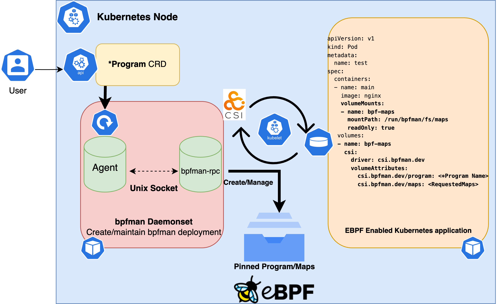

# Developing the bpfman-operator

This section is intended to give developer level details regarding the layout and design of the bpfman-operator.
At its core the operator was implemented using the [operator-sdk framework](https://sdk.operatorframework.io/)
which make those docs another good resource if anything is missed here.

## High level design overview

This repository houses two main processes, the `bpfman-agent` and the `bpfman-operator` along with CRD api definitions
for `BpfProgram` and `*Program` Objects.
The following diagram depicts how all these components work together to create a functioning operator.



## Building and Deploying

For building and deploying the bpfman-operator simply see the attached `make help`
output.

```bash
make help

Usage:
  make <target>

General
  help             Display this help.

Local Dependencies
  kustomize        Download kustomize locally if necessary.
  controller-gen   Download controller-gen locally if necessary.
  register-gen     Download register-gen locally if necessary.
  informer-gen     Download informer-gen locally if necessary.
  lister-gen       Download lister-gen locally if necessary.
  client-gen       Download client-gen locally if necessary.
  envtest          Download envtest-setup locally if necessary.
  opm              Download opm locally if necessary.

Development
  manifests        Generate WebhookConfiguration, ClusterRole and CustomResourceDefinition objects.
  generate         Generate ALL auto-generated code.
  generate-register  Generate register code see all `zz_generated.register.go` files.
  generate-deepcopy  Generate code containing DeepCopy, DeepCopyInto, and DeepCopyObject method implementations see all `zz_generated.register.go` files.
  generate-typed-clients  Generate typed client code
  generate-typed-listers  Generate typed listers code
  generate-typed-informers  Generate typed informers code
  fmt              Run go fmt against code.
  verify           Verify all the autogenerated code
  test             Run Unit tests.
  test-integration  Run Integration tests.
  bundle           Generate bundle manifests and metadata, then validate generated files.
  build-release-yamls  Generate the crd install bundle for a specific release version.

Build
  build            Build bpfman-operator and bpfman-agent binaries.
  build-images     Build bpfman, bpfman-agent, and bpfman-operator images.
  push-images      Push bpfman, bpfman-agent, bpfman-operator images.
  load-images-kind  Load bpfman, bpfman-agent, and bpfman-operator images into the running local kind devel cluster.
  bundle-build     Build the bundle image.
  bundle-push      Push the bundle image.
  catalog-build    Build a catalog image.
  catalog-push     Push a catalog image.

CRD Deployment
  install          Install CRDs into the K8s cluster specified in ~/.kube/config.
  uninstall        Uninstall CRDs from the K8s cluster specified in ~/.kube/config. Call with ignore-not-found=true to ignore resource not found errors during deletion.

Vanilla K8s Deployment
  setup-kind       Setup Kind cluster
  deploy           Deploy bpfman-operator to the K8s cluster specified in ~/.kube/config with the csi driver initialized.
  undeploy         Undeploy bpfman-operator from the K8s cluster specified in ~/.kube/config. Call with ignore-not-found=true to ignore resource not found errors during deletion.
  kind-reload-images  Reload locally build images into a kind cluster and restart the ds and deployment so they're picked up.
  run-on-kind      Kind Deploy runs the bpfman-operator on a local kind cluster using local builds of bpfman, bpfman-agent, and bpfman-operator

Openshift Deployment
  deploy-openshift  Deploy bpfman-operator to the Openshift cluster specified in ~/.kube/config.
  undeploy-openshift  Undeploy bpfman-operator from the Openshift cluster specified in ~/.kube/config. Call with ignore-not-found=true to ignore resource not found errors during deletion.
```

### Project Layout

The bpfman-operator project layout is guided by the recommendations from both the
[operator-sdk framework](https://sdk.operatorframework.io/docs/building-operators/golang/tutorial/#project-layout)
and the [standard golang project-layout](https://github.com/golang-standards/project-layout).
The following is a brief description of the main directories under `bpfman-operator/` and their contents.

**NOTE: Bolded directories contain auto-generated code**

- `apis/v1alpha1/*_types.go`: Contains the K8s CRD api definitions (`*_types.go`) for each version.
- **apis/v1alpha1/zz_generated.*.go**: Contains the auto-generated register (`zz_generate.register.go`)
  and deepcopy (`zz_generated.deepcopy.go`) methods.
- `bundle/`: Contains the OLM bundle manifests and metadata for the operator.
  More details can be found in the operator-sdk documentation.
- `cmd/`: Contains the main entry-points for the bpfman-operator and bpfman-agent processes.
- `config/`: Contains the configuration files for launching the bpfman-operator on a cluster.
    - `bpfman-deployment/`: Contains static deployment yamls for the bpfman-daemon, this includes two containers,
      one for `bpfman` and the other for the `bpfman-agent`.
      This DaemonSet yaml is NOT deployed statically by kustomize, instead it's statically copied into the operator
      image which is then responsible for deploying and configuring the bpfman-daemon DaemonSet.
      Lastly, this directory also contains the default config used to configure the bpfman-daemon, along with the
      cert-manager certificates used to encrypt communication between the bpfman-agent and bpfman.
    - `bpfman-operator-deployment/`: Contains the static deployment yaml for the bpfman-operator.
      This is deployed statically by kustomize.
    - `crd/`: Contains the CRD manifests for all of the bpfman-operator APIs.
        - **bases/**: Is where the actual CRD definitions are stored.
        These definitions are auto-generated by [controller-gen](https://book.kubebuilder.io/reference/controller-gen.html).
        - `patches/`: Contains kustomize patch files for each Program Type, which enables a conversion webhook for
           the CRD and adds a directive for certmanager to inject CA into the CRD.
    - `default/`: Contains the default deployment configuration for the bpfman-operator.
    - `manifests/`: Contains the bases for generating OLM manifests.
    - `openshift/`: Contains the Openshift specific deployment configuration for the bpfman-operator.
    - `prometheus/`: Contains the prometheus manifests used to deploy Prometheus to a cluster.
      At the time of writing this the bpfman-operator is NOT exposing any metrics to prometheus, but this is a future goal.
    - **rbac/**: Contains rbac yamls for getting bpfman and the bpfman-operator up and running on Kubernetes.
        - **bpfman-agent/**: Contains the rbac yamls for the bpfman-agent.
        They are automatically generated by kubebuilder via build tags in the bpfman-agent controller code.
        - **bpfman-operator/**: Contains the rbac yamls for the bpfman-operator.
        They are automatically generated by kubebuilder via build tags in the bpfman-operator controller code.
    - `samples/`: Contains sample CR definitions that can be deployed by users for each of our supported APIs.
    - `scorecard/`: Contains the scorecard manifests used to deploy scorecard to a cluster. At the time of writing
      this the bpfman-operator is NOT running any scorecard tests.
    - `test/`: Contains the test manifests used to deploy the bpfman-operator to a kind cluster for integration testing.
- `controllers/`: Contains the controller implementations for all of the bpfman-operator APIs.
  Each controller is responsible for reconciling the state of the cluster with the desired state defined by the user.
  This is where the source of truth for the auto-generated RBAC can be found, keep an eye out for
  `//+kubebuilder:rbac:groups=bpfman.io` comment tags.
    - `bpfmanagent/`: Contains the controller implementations which reconcile user created `*Program` types to multiple
      `BpfProgram` objects.
    - `bpfmanoperator/`: Contains the controller implementations which reconcile global `BpfProgram` object state back to
      the user by ensuring the user created `*Program` objects are reporting the correct status.
- `hack/`: Contains any scripts+static files used by the bpfman-operator to facilitate development.
- `internal/`: Contains all private library code and is used by the bpfman-operator and bpfman-agent controllers.
- `pkg/`: Contains all public library code this is consumed externally and internally.
    - **client/**: Contains the autogenerated clientset, informers and listers for all of the bpfman-operator APIs.
      These are autogenerated by the [k8s.io/code-generator project](https://github.com/kubernetes/code-generator),
      and can be consumed by users wishing to programmatically interact with bpfman specific APIs.
    - `helpers/`: Contains helper functions which can be consumed by users wishing to programmatically interact with
      bpfman specific APIs.
- `test/integration/`: Contains integration tests for the bpfman-operator.
  These tests are run against a kind cluster and are responsible for testing the bpfman-operator in a real cluster
  environment.
  It uses the [kubernetes-testing-framework project](https://github.com/Kong/kubernetes-testing-framework) to
  programmatically spin-up all of the required infrastructure for our unit tests.
- `Makefile`: Contains all of the make targets used to build, test, and generate code used by the bpfman-operator.

### RPC Protobuf Generation

Technically part of the `bpfman` API, the RPC Protobufs are usually not coded until a bpfman feature is
integrated into the `bpfman-operator` and `bpfman-agent` code.
To modify the RPC Protobuf definition, edit
[proto/bpfman.proto](https://github.com/bpfman/bpfman/blob/main/proto/bpfman.proto).
Then to generate the protobufs from the updated RPC Protobuf definitions:

```bash
cd bpfman/
cargo xtask build-proto
```

This will generate:

- **bpfman-api/src/bpfman.v1.rs**: Generated Rust Protobuf source code.
- **clients/gobpfman/v1/**: Directory that contains the generated Go Client code for interacting
  with bpfman over RPC from a Go application.

When editing 
[proto/bpfman.proto](https://github.com/bpfman/bpfman/blob/main/proto/bpfman.proto),
follow best practices describe in
[Proto Best Practices](https://protobuf.dev/programming-guides/dos-donts/).

!!! Note
    `cargo xtask build-proto` also pulls in 
    [proto/csi.proto](https://github.com/bpfman/bpfman/blob/main/proto/csi.proto) (which is in the
    same directory as
    [proto/bpfman.proto](https://github.com/bpfman/bpfman/blob/main/proto/bpfman.proto)).
    [proto/csi.proto](https://github.com/bpfman/bpfman/blob/main/proto/csi.proto) is taken from
    [container-storage-interface/spec/csi.proto](https://github.com/container-storage-interface/spec/blob/master/csi.proto).
    See [container-storage-interface/spec/spec.md](https://github.com/container-storage-interface/spec/blob/master/spec.md)
    for more details.

### Generated Files

The [operator-sdk framework](https://sdk.operatorframework.io/docs/building-operators/golang/tutorial/#project-layout)
will generate multiple categories of files (Custom Resource Definitions (CRD), RBAC ClusterRole, Webhook Configuration,
typed client, listeners and informers code, etc).
If any of the
[bpfman-operator/apis/v1alpha1/*Program_types.go](https://github.com/bpfman/bpfman/tree/main/bpfman-operator/apis/v1alpha1)
files are modified, then regenerate these files using:

```bash
cd bpfman/bpfman-operator/
make generate
```

This command will generate all auto-generated code.
There are commands to generate each sub-category if needed.
See `make help` to list all the generate commands.

### Building

To run in Kubernetes, bpfman components need to be containerized.
However, building container images can take longer than just building the code.
During development, it may be quicker to find and fix build errors by just building the code.
To build the code:

```bash
cd bpfman/bpfman-operator/
make build
```

To build the container images, run the following command:

```bash
cd bpfman/bpfman-operator/
make build-images
```

If the `make build` command is skipped above, the code will be built in the build-images command.
If the `make build` command is run, the built code will be leveraged in this step.
This command generates the following images:

```bash
docker images
REPOSITORY                       TAG      IMAGE ID       CREATED          SIZE
quay.io/bpfman/bpfman            latest   69df038ccea3   43 seconds ago   515MB
quay.io/bpfman/bpfman-agent      latest   f6af33c5925b   2 minutes ago    464MB
quay.io/bpfman/bpfman-operator   latest   4fe444b7abf1   2 minutes ago    141MB
:
```

## Running Locally in KIND

[Deploying the bpfman-operator](./operator-quick-start.md) goes into more detail on ways to
launch bpfman in a Kubernetes cluster.
To run locally in a Kind cluster with an up to date build simply run:

```bash
cd bpfman/bpfman-operator/
make run-on-kind
```

The `make run-on-kind` will run the `make build-images` if the images do not exist or need updating.

Then rebuild and load a fresh build run:

```bash
cd bpfman/bpfman-operator/
make build-images
make kind-reload-images
```

Which will rebuild the bpfman-operator, bpfman-agent, and bpfman images and load them into the kind cluster.

By default, the `make run-on-kind` uses the `quay.io/bpfman/bpfman*` images described above.
The container images used for `bpfman`, `bpfman-agent`, and `bpfman-operator` can also be manually configured:

```bash
BPFMAN_IMG=<your/image/url> BPFMAN_AGENT_IMG=<your/image/url> BPFMAN_OPERATOR_IMG=<your/image/url> make run-on-kind
```

## Testing Locally

See [Kubernetes Operator Tests](https://bpfman.io/main/developer-guide/testing/#kubernetes-operator-tests). 

## Troubleshooting

### Metrics/Health port issues

In some scenarios, the health and metric ports may are already in use by other services on the system.
When this happens the bpfman-agent container fails to deploy.
The ports currently default to 8175 and 8174.

The ports are passed in through the [daemonset.yaml] for the `bpfman-daemon` and [deployment.yaml] and
[manager_auth_proxy_patch.yaml] for the `bpfman-operator`.
The easiest way to change which ports are used is to update these yaml files and rebuild the container images.
The container images need to be rebuilt because the `bpfman-daemon` is deployed from the `bpfman-operator`
and the associated yaml files are copied into the `bpfman-operator` image.

If rebuild the container images is not desirable, then the ports can be changed on the fly.
For the `bpfman-operator`, the ports can be updated by editing the `bpfman-operator` Deployment.

```console
kubectl edit deployment -n bpfman bpfman-operator

apiVersion: apps/v1
kind: Deployment
:
spec:
  template:
  :
  spec:
    containers:
    -args:
      - --secure-listen-address=0.0.0.0:8443
      - --upstream=http://127.0.0.1:8174/        <-- UPDATE
      - --logtostderr=true
      - --v=0
      name: kube-rbac-proxy
      :
    - args:
      - --health-probe-bind-address=:8175        <-- UPDATE
      - --metrics-bind-address=127.0.0.1:8174    <-- UPDATE
      - --leader-elect
      :
      livenessProbe:
          failureThreshold: 3
          httpGet:
            path: /healthz
            port: 8175                           <-- UPDATE
            scheme: HTTP
            :
      name: bpfman-operator
      readinessProbe:
          failureThreshold: 3
          httpGet:
            path: /readyz
            port: 8175                           <-- UPDATE
            scheme: HTTP
      :
```

For the `bpfman-daemon`, the ports could be updated by editing the `bpfman-daemon` DaemonSet.
However, if `bpfman-daemon` is restarted for any reason by the `bpfman-operator`, the changes
will be lost. So it is recommended to update the ports for the `bpfman-daemon` via the bpfman
`bpfman-config` ConfigMap.

```console
kubectl edit configmap -n bpfman bpfman-config

apiVersion: v1
data:
  bpfman.agent.healthprobe.addr: :8175                    <-- UPDATE
  bpfman.agent.image: quay.io/bpfman/bpfman-agent:latest
  bpfman.agent.log.level: info
  bpfman.agent.metric.addr: 127.0.0.1:8174                <-- UPDATE
  bpfman.image: quay.io/bpfman/bpfman:latest
  bpfman.log.level: debug
kind: ConfigMap
:
```

[daemonset.yaml]: https://github.com/bpfman/bpfman/blob/main/bpfman-operator/config/bpfman-deployment/daemonset.yaml
[deployment.yaml]: https://github.com/bpfman/bpfman/blob/main/bpfman-operator/config/bpfman-operator-deployment/deployment.yaml
[manager_auth_proxy_patch.yaml]: https://github.com/bpfman/bpfman/blob/main/bpfman-operator/config/default/manager_auth_proxy_patch.yaml
