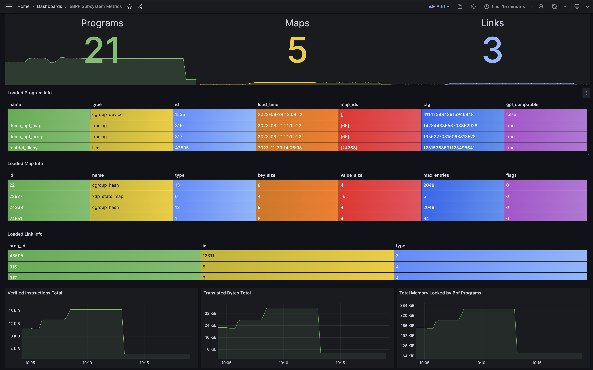

# Observability

## eBPF Metrics Exporter

The eBPF Metrics Exporter (`bpf-metrics-exporter`) exports metrics from the kernel's BPF
subsystem to OpenTelmetry.

!!! NOTE
    An initial set of metrics have been added as a proof of concept.
    The metrics can be enriched with other metrics from the system as use cases are identified.
    For example, a possible improvement could be to correlate process IDs -> containers -> k8s pods.

### Metrics

The following metrics are currently exported, this list will continue to expand:

#### [Gauges](https://opentelemetry.io/docs/specs/otel/metrics/api/#gauge)

- `bpf_program_info`: Information on each loaded BPF Program
    - Labels:
        - `id`: The ID of the BPF program
        - `name`: The name of the BPF program
        - `type`: The type of the BPF program as a readable string
        - `tag`: The tag of the BPF program
        - `gpl_compatible`: Whether the BPF program is GPL compatible
        - `map_ids`: List of associated maps, if any
        - `load_time`: The time the BPF program was loaded
- `bpf_map_info`: Information of each loaded BPF Map
    - Labels:
        - `id`: The ID of the BPF map
        - `name`: The name of the BPF map
        - `type`: The type of the BPF map as an `u32` which corresponds to the following
           [kernel enumeration](https://elixir.bootlin.com/linux/v6.6.3/source/include/uapi/linux/bpf.h#L906)
        - `key_size`: The key size in bytes for the BPF map
        - `value_size`: The value size for the BPF map
        - `max_entries`: The maximum number of entries for the BPF map.
        - `flags`: Loadtime specific flags for the BPF map
- `bpf_link_info`: Information on each of the loaded BPF Link
    - Labels:
        - `id`: The ID of the bpf Link
        - `prog_id`: The Program ID of the BPF program which is using the Link.
        - `type`: The BPF Link type as a `u32` which corresponds to the following
           [kernel enumeration](https://elixir.bootlin.com/linux/v6.6.3/source/include/uapi/linux/bpf.h#L1048)
- `bpf_program_load_time`: The standard UTC time the program was loaded in seconds
    - Labels:
        - `id`: The ID of the BPF program
        - `name`: The name of the BPF program
        - `type`: The type of the BPF program as a readable string

#### [Counters](https://opentelemetry.io/docs/specs/otel/metrics/api/#counter)

- `bpf_program_size_jitted_bytes`: The size in bytes of the program's JIT-compiled machine code.
    - Labels:
        - `id`: The ID of the BPF program
        - `name`: The name of the BPF program
        - `type`: The type of the BPF program as a readable string
- `bpf_program_size_translated_bytes`: The size of the BPF program in bytes.
    - Labels:
        - `id`: The ID of the BPF program
        - `name`: The name of the BPF program
        - `type`: The type of the BPF program as a readable string
- `bpf_program_mem_bytes`: The amount of memory used by the BPF program in bytes.
    - Labels:
        - `id`: The ID of the BPF program
        - `name`: The name of the BPF program
        - `type`: The type of the BPF program as a readable string
- `bpf_program_verified_instructions`: The number of instructions in the BPF program.
    - Labels:
        - `id`: The ID of the BPF program
        - `name`: The name of the BPF program
        - `type`: The type of the BPF program as a readable string
- `bpf_map_key_size`: The size of the BPF map key
    - Labels:
        - `id`: The ID of the BPF map
        - `name`: The name of the BPF map
        - `type`: The type of the BPF map as an `u32` which corresponds to the following [kernel enumeration](https://elixir.bootlin.com/linux/v6.6.3/source/include/uapi/linux/bpf.h#L906)
- `bpf_map_value_size`: The size of the BPF map value
    - Labels:
        - `id`: The ID of the BPF map
        - `name`: The name of the BPF map
        - `type`: The type of the BPF map as an `u32` which corresponds to the following [kernel enumeration](https://elixir.bootlin.com/linux/v6.6.3/source/include/uapi/linux/bpf.h#L906)
- `bpf_map_max_entries`: The maximum number of entries allowed for the BPF map
    - Labels:
        - `id`: The ID of the BPF map
        - `name`: The name of the BPF map
        - `type`: The type of the BPF map as an `u32` which corresponds to the following [kernel enumeration](https://elixir.bootlin.com/linux/v6.6.3/source/include/uapi/linux/bpf.h#L906)

!!! Note
    All counters will need to have the suffix `_total` appended when exposed as a
    [sample metric](https://github.com/OpenObservability/OpenMetrics/blob/main/specification/OpenMetrics.md#counter-1)
    (For an example, search for `_total` in
    [bpf-metrics-exporter/metrics-stack.yaml](https://github.com/bpfman/bpfman/blob/main/bpf-metrics-exporter/metrics-stack.yaml)).

### Try it Out

***Grafana Stack:***

You'll need a Grafana stack set up.
You can quickly deploy one using:

```bash
podman play kube metrics-stack.yaml
```

***Installation:***

`bpf-metrics-exporter` can be installed using the installation script:

```console
cd bpfman/
sudo ./scripts/setup.sh install
```

***Run:***

Then, you can deploy the exporter:

```bash
sudo bpf-metrics-exporter
```

***Verify:***

You can log into grafana at `http://localhost:3000/` using the default user:password
`admin:admin`.

From there simply select the default dashboard titled `eBPF Subsystem Metrics`:



***Cleanup:***

In order to clean everything up simply exit the bpf-metrics-exporter process with
`<CTRL>C` and run:

```bash
podman kube down metrics-stack.yaml
```

## eBPF Log Exporter

The eBPF Log Exporter (`bpf-log-exporter`) is a utility tool that registers with the kernel
auditing service to receive audit events.
The eBPF Log Exporter filters out eBPF related events.
Currently, these events are then printed to the terminal.
Long term, these events will be forwarded as logs to OpenTelemetry.

!!! NOTE
    eBPF Log Exporter is a work in progress.
    Currently, audit events are just printed to a terminal, but the long term plan is for these events
    to be forwarded as logs to OpenTelemetry similar to how bpf-metric-exporter is implemented.

***Prerequisites:***

* Auditing must be enabled in the kernel.

***Installation:***

`bpf-log-exporter` can be installed using the installation script:

```console
cd bpfman/
sudo ./scripts/setup.sh install
```

***Run:***

`bpf-log-exporter` needs root privileges to run.
To see the logs, run with at least `info` level logs enabled.

```console
$ sudo RUST_LOG=info bpf-log-exporter
[INFO  bpf_log_exporter] AUDIT_BPF: LogMessage { timestamp: "1727301213.084", prog_id: 326, op: "LOAD", syscall_op: 0, pid: 0, uid: 0, gid: 0, comm: "", cmdline: "" }
[INFO  bpf_log_exporter] AUDIT_BPF: LogMessage { timestamp: "1727301213.095", prog_id: 327, op: "LOAD", syscall_op: 0, pid: 0, uid: 0, gid: 0, comm: "", cmdline: "" }
[INFO  bpf_log_exporter] AUDIT_BPF: LogMessage { timestamp: "1727301213.109", prog_id: 326, op: "UNLOAD", syscall_op: 0, pid: 0, uid: 0, gid: 0, comm: "", cmdline: "" }
[INFO  bpf_log_exporter] AUDIT_BPF: LogMessage { timestamp: "1727301213.109", prog_id: 327, op: "UNLOAD", syscall_op: 0, pid: 0, uid: 0, gid: 0, comm: "", cmdline: "" }
[INFO  bpf_log_exporter] AUDIT_BPF: LogMessage { timestamp: "1727301228.487", prog_id: 328, op: "LOAD", syscall_op: 0, pid: 0, uid: 0, gid: 0, comm: "", cmdline: "" }
[INFO  bpf_log_exporter] AUDIT_BPF: LogMessage { timestamp: "1727301228.488", prog_id: 328, op: "UNLOAD", syscall_op: 0, pid: 0, uid: 0, gid: 0, comm: "", cmdline: "" }
[INFO  bpf_log_exporter] AUDIT_BPF: LogMessage { timestamp: "1727301228.488", prog_id: 329, op: "LOAD", syscall_op: 0, pid: 0, uid: 0, gid: 0, comm: "", cmdline: "" }
[INFO  bpf_log_exporter] AUDIT_BPF: LogMessage { timestamp: "1727301228.488", prog_id: 329, op: "UNLOAD", syscall_op: 0, pid: 0, uid: 0, gid: 0, comm: "", cmdline: "" }
:
```

Then use `<CTRL>C` to stop.