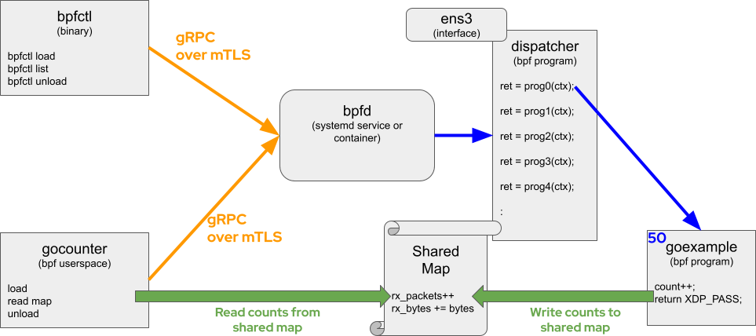
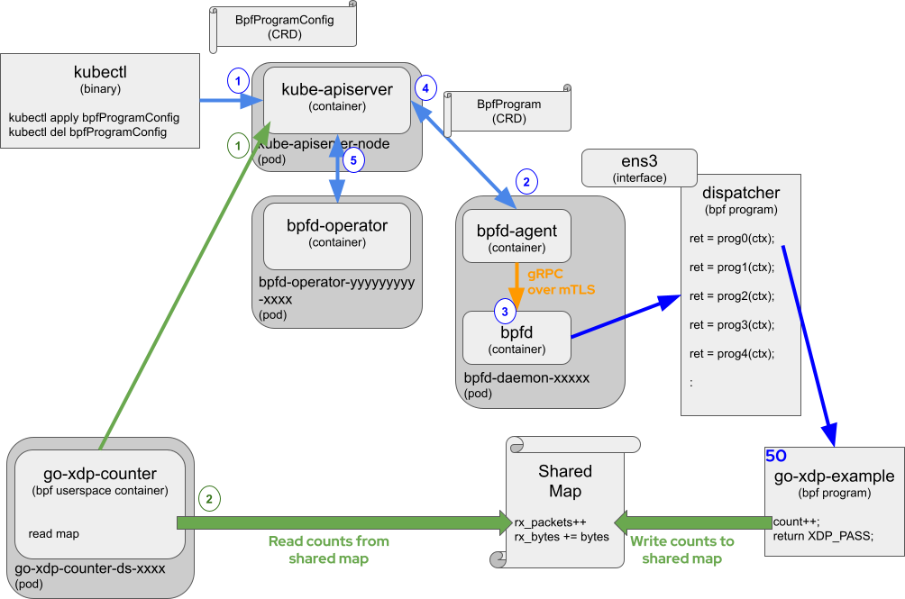

# Example BPF Programs

Example applications that use the `bpfd-go` bindings can be found in
[examples/go-xdp-counter/](https://github.com/redhat-et/bpfd/tree/main/examples/go-xdp-counter) and
[examples/go-tc-counter/](https://github.com/redhat-et/bpfd/tree/main/examples/go-tc-counter).
These examples and the associated documentation is intended to provide the basics on how to deploy
and manage a BPF program using bpfd.
There are two ways to deploy these example applications, simply run locally on one machine, or deploy
to multiple nodes in a Kubernetes cluster.

The `go-xdp-counter` and  `go-tc-counter` examples each contain a BPF Program written in C
([xdp_counter.c](https://github.com/redhat-et/bpfd/tree/main/examples/go-xdp-counter/bpf/xdp_counter.c) and
[tc_counter.c](https://github.com/redhat-et/bpfd/tree/main/examples/go-tc-counter/bpf/tc_counter.c))
that is compiled into BPF bytecode.
The BPF program counts packets that are received on an interface and stores the packet and byte
counts in a map that is accessible by the userspace portion.
The `go-xdp-counter` and  `go-tc-counter` examples each also have a userspace portion written in GO.
When run locally, the userspace program makes gRPC calls to `bpfd` requesting `bpfd` to load the BPF program
at the requested hook Point (XDP hook point or the TC hook point).
When run in a Kubernetes deployment, the `bpfd-agent` makes gRPC calls to `bpfd` requesting `bpfd` to load
the BPF program based on a `BpfProgramConfig` Custom Resource Definition (CRD), which is described in more
detail below.
Independent of the deployment, the userspace program then polls the BPF map every 3 seconds and logs the
current counts.
The userspace code is leveraging the [cilium/ebpf library](https://github.com/cilium/ebpf)
to manage the maps shared with the BPF program.
The XDP and TC programs are very similar in functionality, and only vary where in the Linux networking stack
they are inserted.
Read more about XDP and TC programs [here](https://docs.cilium.io/en/latest/bpf/progtypes/).

## Table of Contents

- [Deploying Locally](#deploying-locally)
  - [Building](#building)
    - [Prerequisites](#prerequisites)
    - [Building Locally](#building-locally)
  - [Running On Host](#running-on-host)
     - [Running Privileged](#running-privileged)
     - [Running Unprivileged](#running-unprivileged)
  - [Passing BPF Bytecode In A Container Image](#passing-bpf-bytecode-in-a-container-image)
     - [Building BPF Bytecode Container Image](#building-bpf-bytecode-container-image)
     - [Preloading BPF Bytecode](#preloading-bpf-bytecode)
- [Deploying On Kubernetes](#deploying-on-kubernetes)
   - [Loading BPF Bytecode On Kubernetes](#loading-bpf-bytecode-on-kubernetes)
   - [Loading Userspace Container On Kubernetes](#loading-userspace-container-on-kubernetes)
     - [Building A Userspace Container Image](#building-a-userspace-container-image)
     - [Loading A Userspace Container Image](#loading-a-userspace-container-image)
- [Notes](#notes)

## Deploying Locally

This section describes running bpfd and the example bpf programs on a local host.
When running bpfd, it can be run as a process or run as a systemd service.
Examples run the same, independent of how bpfd is deployed, other than requiring `sudo` or not.

### Building

To build directly on a system, make sure all the prerequisites are met, then build.

#### Prerequisites

**Assuming bpfd is already installed and running on the system**

1. All [requirements defined by the `cilium/ebpf` package](https://github.com/cilium/ebpf#requirements)
2. libbpf development package to get the required bpf c headers

    Fedora:

    `sudo dnf install libbpf-devel`

    Ubuntu:

    `sudo apt-get install libbpf-dev`

3. Cilium's `bpf2go` binary

    `go install github.com/cilium/ebpf/cmd/bpf2go@master`


#### Building Locally

To build the C based BPF counter bytecode, run:

```console
    cd src/bpfd/examples/go-xdp-counter/
    go generate
```

To build the Userspace GO Client run:

```console
    cd src/bpfd/examples/go-xdp-counter/
    go build
```

Repeat for TC if desired:
```console
    cd src/bpfd/examples/go-tc-counter/
    go generate
    go build
```

### Running On Host

The most basic way to deploy this example is running directly on a host system.
First, start or ensure `bpfd` is up and running.
[tutorial.md](../admin/tutorial.md) will guide you through deploying `bpfd`.
In all the examples of running `go-xdp-counter` or `go-tc-counter` on a host system,
a bpfd-client certificate is used that is generated by `bpfd` to encrypt the application's
connection to `bpfd`.
The diagram below shows `go-xdp-counter` example, but the `go-tc-counter` example
operates exactly the same way.



Following the diagram (Purple numbers):
1. When `go-xdp-counter` userspace is started, it will send a gRPC request
over mTLS to `bpfd` requesting `bpfd` to load the `go-xdp-counter` BPF bytecode located on disk
at `bpfd/examples/go-xdp-counter/bpf_bpfel.o` at a priority of 50 and on interface `ens3`.
These values are configurable as we will see later, but for now we will use the defaults
(except interface, which is required to be entered).
2. `bpfd` will load it's `dispatcher` BPF program, which links to the `go-xdp-counter` BPF program
and return a UUID describing the running program.
3. `bpfctl list` can be used to show that the BPF program was loaded.
`bpfctl` also sends gRPC requests over mTLS to perform actions and request data from `bpfd`.
4. Once the `go-xdp-counter` BPF bytecode is loaded, the BPF program will write packet counts
and byte counts to a shared map.
5. `go-xdp-counter` userspace program periodically reads counters from the shared map and logs
the value.

#### Running Privileged

The most basic example, just use `sudo` to start the `go-xdp-counter` program.
Determine the host interface to attach the BPF program to and then start the go program with:

```console
    cd src/bpfd/examples/go-xdp-counter/
    sudo ./go-xdp-counter -iface <INTERNET INTERFACE NAME>
```
or (**NOTE:** TC programs also require a direction, ingress or egress)
```console
    cd src/bpfd/examples/go-tc-counter/
    sudo ./go-tc-counter -direction ingress -iface <INTERNET INTERFACE NAME>
```

The output should show the count and total bytes of packets as they pass through the
interface as shown below:

```console
    sudo ./go-xdp-counter -iface ens3
    2022/12/02 15:59:34 Reading /etc/bpfd/gocounter.toml ...
    2022/12/02 15:59:34 Read /etc/bpfd/gocounter.toml failed: err open /etc/bpfd/gocounter.toml: no such file or directory
    2022/12/02 15:59:34 Using Input: Interface=ens3 Priority=50 Source=bpf_bpfel.o
    2022/12/02 15:59:35 Program registered with b6b2107c-f1a3-48ac-a145-1073c0979ba4 id
    2022/12/02 15:59:38 0 packets received
    2022/12/02 15:59:38 0 bytes received

    2022/12/02 15:59:41 4 packets received
    2022/12/02 15:59:41 580 bytes received

    :
```

Use `bpfctl` to show the `go-xdp-counter` BPF bytecode was loaded.

```console
    bpfctl list
    UUID                                  Type  Name   Path                                                      Metadata
    b6b2107c-f1a3-48ac-a145-1073c0979ba4  xdp   stats  /home/$USER/src/bpfd/examples/go-xdp-counter/bpf_bpfel.o  { "priority": 50, "iface": "ens3", "position": 0, "proceed_on": ["pass", "dispatcher_return"] }
```

Finally, press `<CTRL>+c` when finished with `go-xdp-counter`.

```console
    :

    2022/12/02 16:00:56 64 packets received
    2022/12/02 16:00:56 9280 bytes received

    2022/12/02 16:00:59 64 packets received
    2022/12/02 16:00:59 9280 bytes received

    ^C2022/12/02 16:01:00 Exiting...
    2022/12/02 16:01:00 Unloading Program: b6b2107c-f1a3-48ac-a145-1073c0979ba4
```

#### Running Unprivileged

To run the `go-xdp-counter` and `go-tc-counter` examples unprivileged (without `sudo`), the
following three steps must be performed.

##### Step 1: Create `bpfd` User Group

The [tutorial.md](../admin/tutorial.md) guide describes the different modes `bpfd` can be run in.
Specifically, the [Systemd Service](../admin/tutorial.md#systemd-service) section explains how to
start `bpfd` and create the `bpfd` Users and `bpfd` User Group.
`bpfd` must be started as a Systemd Service and `go-xdp-counter` must be run from a User that is a
member of the `bpfd` User Group.

```console
    sudo usermod -a -G bpfd $USER
    exit
    <LOGIN>
```

##### Step 2: Grant CAP_BPF Linux Capability

`go-xdp-counter` and `go-tc-counter` use a map to share data between the userspace side of the program
and the BPF portion.
Accessing this map requires access to the CAP_BPF capability.
Run the following command to grant `go-xdp-counter` access to the CAP_BPF capability:

```console
    cd src/bpfd/examples/go-xdp-counter/
    sudo /sbin/setcap cap_dac_override,cap_bpf=ep ./go-xdp-counter
```
and
```console
    cd src/bpfd/examples/go-tc-counter/
    sudo /sbin/setcap cap_dac_override,cap_bpf=ep ./go-tc-counter
```

**Reminder:** The capability must be re-granted each time the examples are rebuilt.

##### Step 3: Start `go-xdp-counter` without `sudo`

Start `go-xdp-counter` without `sudo`:

```console
    ./go-xdp-counter -iface ens3
    2022/12/02 15:59:34 Reading /etc/bpfd/gocounter.toml ...
    2022/12/02 15:59:34 Read /etc/bpfd/gocounter.toml failed: err open /etc/bpfd/gocounter.toml: no such file or directory
    2022/12/02 15:59:34 Using Input: Interface=ens3 Priority=50 Source=bpf_bpfel.o
    2022/12/02 15:59:35 Program registered with b6b2107c-f1a3-48ac-a145-1073c0979ba4 id
    2022/12/02 15:59:38 0 packets received
    2022/12/02 15:59:38 0 bytes received

    2022/12/02 15:59:41 4 packets received
    2022/12/02 15:59:41 580 bytes received

    :

    2022/12/02 16:00:59 64 packets received
    2022/12/02 16:00:59 9280 bytes received

    ^C2022/12/02 16:01:00 Exiting...
    2022/12/02 16:01:00 Unloading Program: b6b2107c-f1a3-48ac-a145-1073c0979ba4
```

### Passing BPF Bytecode In A Container Image

bpfd can load BPF bytecode from a container image built following the spec described in
[shipping-bytecode.md](../../docs/admin/shipping-bytecode.md).
Pre-built `go-xdp-counter` and `go-tc-counter` BPF container images can be loaded from
`quay.io/bpfd-bytecode/go-xdp-counter:latest` or `quay.io/bpfd-bytecode/go-tc-counter:latest`.
To use the container image, pass the URL to the userspace program:

```console
    ./go-xdp-counter -iface ens3 -location image://quay.io/bpfd-bytecode/go-xdp-counter:latest
    2022/12/02 16:28:32 Reading /etc/bpfd/gocounter.toml ...
    2022/12/02 16:28:32 Read /etc/bpfd/gocounter.toml failed: err open /etc/bpfd/gocounter.toml: no such file or directory
    2022/12/02 16:28:32 Using Input: Interface=ens3 Priority=50 Source=quay.io/bpfd-bytecode/go-xdp-counter:latest
    2022/12/02 16:28:34 Program registered with 8d89a6b6-bce2-4d3f-9cee-9cb0c689a90e id
    2022/12/02 16:28:37 4 packets received
    2022/12/02 16:28:37 580 bytes received

    2022/12/02 16:28:40 4 packets received
    2022/12/02 16:28:40 580 bytes received

    ^C2022/12/02 16:28:42 Exiting...
    2022/12/02 16:28:42 Unloading Program: 8d89a6b6-bce2-4d3f-9cee-9cb0c689a90e
```

#### Building BPF Bytecode Container Image

[shipping-bytecode.md](../../docs/admin/shipping-bytecode.md) provides detailed instructions on
building and shipping bytecode in a container image.
To build `go-xdp-counter` and `go-tc-counter` BPF bytecode container image, first make sure the
bytecode has been built (i.e. `bpf_bpfel.o` has been built - see [Building](#building]), then
run the build commands below:

```console
    cd src/bpfd/examples/go-xdp-counter/
    go generate

    docker build \
      --build-arg PROGRAM_NAME=go-xdp-counter \
      --build-arg SECTION_NAME=stats \
      --build-arg PROGRAM_TYPE=xdp \
      --build-arg BYTECODE_FILENAME=bpf_bpfel.o \
      --build-arg KERNEL_COMPILE_VER=$(uname -r) \
      -f ../../packaging/container-deployment/Containerfile.bytecode . -t quay.io/$USER/go-xdp-counter-bytecode:latest
```

and

```console
    cd src/bpfd/examples/go-tc-counter/
    go generate

    docker build \
      --build-arg PROGRAM_NAME=go-tc-counter \
      --build-arg SECTION_NAME=stats \
      --build-arg PROGRAM_TYPE=tc \
      --build-arg BYTECODE_FILENAME=bpf_bpfel.o \
      --build-arg KERNEL_COMPILE_VER=$(uname -r) \
      -f ../../packaging/container-deployment/Containerfile.bytecode . -t quay.io/$USER/go-tc-counter-bytecode:latest
```

`bpfd` currently only supports pulling a remote container image, so push the image to a remote
repository.
For example:

```console
    docker login quay.io
    docker push quay.io/$USER/go-xdp-counter-bytecode:latest
    docker push quay.io/$USER/go-tc-counter-bytecode:latest
```

Then run with the privately built bytecode container image:

```console
    ./go-tc-counter -iface ens3 -direction ingress -location image://quay.io/$USER/go-tc-counter-bytecode:latest
    2022/12/02 16:38:44 Reading /etc/bpfd/gocounter.toml ...
    2022/12/02 16:38:44 Read /etc/bpfd/gocounter.toml failed: err open /etc/bpfd/gocounter.toml: no such file or directory
    2022/12/02 16:38:44 Using Input: Interface=ens3 Priority=50 Source=quay.io/$USER/go-tc-counter-bytecode:latest
    2022/12/02 16:38:45 Program registered with 0d313a4a-a17c-4c70-81ba-3ecc494b900e id
    2022/12/02 16:38:48 4 packets received
    2022/12/02 16:38:48 580 bytes received

    2022/12/02 16:38:51 4 packets received
    2022/12/02 16:38:51 580 bytes received

    ^C2022/12/02 16:38:51 Exiting...
    2022/12/02 16:38:51 Unloading Program: 0d313a4a-a17c-4c70-81ba-3ecc494b900e
```

#### Preloading BPF Bytecode

Another way to load the BPF bytecode is to pre-load the BPF bytecode and
pass the associated `bpfd` UUID to the userspace program.
This is similar to how BPF programs will be loaded in Kubernetes, except `kubectl` commands will be
used to create `bpfProgramConfig` kubernetes object objects instead of using `bpfctl`, but that
is covered in the next section.
The userspace programs will skip the loading portion and use the UUID to find the shared
map and continue from there.

Referring back to the diagram above, the `load` and `unload` are being done by `bpfctl` and not
`go-xdp-counter` userspace program.

First, use `bpfctl` to load the `go-xdp-counter` BPF bytecode:

```console
    bpfctl load --location image://quay.io/bpfd-bytecode/go-xdp-counter:latest xdp --iface ens3 --priority 50
    d541af30-69be-44cf-9397-407ee512547a
```

Then run the `go-xdp-counter` userspace program, passing in the UUID:

```console
    ./go-xdp-counter -iface ens3 -uuid d541af30-69be-44cf-9397-407ee512547a
    2022/12/02 17:01:38 Using Input: Interface=ens3 Source=d541af30-69be-44cf-9397-407ee512547a
    2022/12/02 17:01:41 180 packets received
    2022/12/02 17:01:41 26100 bytes received

    2022/12/02 17:01:44 184 packets received
    2022/12/02 17:01:44 26680 bytes received

    ^C2022/12/02 17:01:46 Exiting...
```

Then use `bpfctl` to unload the BPF bytecode:

```console
    bpfctl unload d541af30-69be-44cf-9397-407ee512547a
```

## Deploying On Kubernetes

This section will describe loading bytecode on a Kubernetes cluster and launching the userspace
program.
The approach is slightly different when running on a Kubernetes cluster.
The BPF bytecode should be loaded by an administrator, not the userspace program itself.



### Loading BPF Bytecode On Kubernetes

This assumes there is already a Kubernetes cluster running and `bpfd` is running in the cluster
(see [How to Manually Deploy bpfd on Kubernetes](../admin/k8s-deployment.md)).
Instead of using the userspace program or `bpfctl` to load the BPF bytecode as done above, the bytecode
will be loaded by creating a `BpfProgramConfig` kubernetes object.
Edit the
[go-xdp-counter-bytecode.yaml](../../examples/go-xdp-counter/kubernetes-deployment/go-xdp-counter-bytecode.yaml)
file to customize, primarily setting the interface.
Also note that the `BpfProgramConfig` is running the bytecode on all nodes (`nodeselector: {}`).
This can be change to run on specific nodes, but the DaemonSet yaml for the userspace program, which
is described below, should have an equivalent change
(see [go-xdp-counter.yaml](../../examples/go-xdp-counter/kubernetes-deployment/go-xdp-counter.yaml)).

```console
    vi examples/go-xdp-counter/kubernetes-deployment/go-xdp-counter-bytecode.yaml
    apiVersion: bpfd.io/v1alpha1
    kind: BpfProgramConfig
    metadata:
      labels:
        app.kubernetes.io/name: bpfprogramconfig
      name: go-xdp-counter-example
    spec:
      ## Must correspond to image section name
      name: stats
      type: XDP
      # Select all nodes
      nodeselector: {}
      attachpoint:
        networkmultiattach:
          interface: eth0
          priority: 55
      bytecode: image://quay.io/bpfd-bytecode/go-xdp-counter-latest
```

Repeat for `go-tc-counter-bytecode.yaml` and then apply the updated yamls:

```console
    kubectl apply -f examples/go-xdp-counter/kubernetes-deployment/go-xdp-counter-bytecode.yaml
    bpfprogramconfig.bpfd.io/go-xdp-counter-example created

    kubectl apply -f examples/go-tc-counter/kubernetes-deployment/go-tc-counter-bytecode.yaml
    bpfprogramconfig.bpfd.io/go-tc-counter-example created
```

Following the diagram (Blue numbers):
1. The user creates a `BpfProgramConfig` object with the parameters
associated with the BPF bytecode, like interface, priority and BFP bytecode image.
The name of the `BpfProgramConfig` object in this example is `go-xdp-counter-example`.
2. `bpfd-agent`, running on each node, is watching for all changes to `BpfProgramConfig` objects.
When it sees a `BpfProgramConfig` object modified, it makes sure a `BpfProgram` object for that
node exists. The name of the `BpfProgram` object is the `BpfProgramConfig` object name with the
node name appended.
3. `bpfd-agent` then determines if it should be running on the given node, loads or unloads as needed
by making gRPC calls the `bpfd`.
`bpfd` behaves the same as described in the running locally example.
4. `bpfd-agent` finally updates the status of the `BpfProgram` object.
5. `bpfd-operator` watches all `BpfProgram` objects, and updates the status of the `BpfProgramConfig`
object indicating if the BPF program has been applied to all the desired nodes or not.

To retrieve information on the `BpfProgramConfig` objects:

```console
    kubectl get bpfprogramconfigs
    NAME                     AGE
    go-tc-counter-example    3d5h
    go-xdp-counter-example   3d5h

    kubectl get bpfprogramconfigs go-xdp-counter-example -o yaml
    apiVersion: bpfd.io/v1alpha1
    kind: BpfProgramConfig
    metadata:
      creationTimestamp: "2023-01-06T15:04:22Z"
      finalizers:
      - bpfd.io.operator/finalizer
      generation: 1
      labels:
        app.kubernetes.io/name: bpfprogramconfig
      name: go-xdp-counter-example
      resourceVersion: "268771"
      uid: 81a9d2ea-52fc-4c5a-8a57-d3189119fad2
    spec:
      attachpoint:
        networkmultiattach:
          direction: NONE
          interface: eth0
          priority: 55
      bytecode: image://quay.io/bpfd-bytecode/go-xdp-counter:latest
      name: stats
      nodeselector: {}
      type: XDP
    status:
      conditions:
      - lastTransitionTime: "2023-01-06T15:04:22Z"
        message: Waiting for BpfProgramConfig Object to be reconciled to all nodes
        reason: ProgramsNotYetLoaded
        status: "True"
        type: NotYetLoaded
      - lastTransitionTime: "2023-01-06T15:04:22Z"
        message: bpfProgramReconciliation Succeeded on all nodes
        reason: ReconcileSuccess
        status: "True"
        type: ReconcileSuccess
```

To retrieve information on the `BpfProgram` objects:

```console
    kubectl get bpfprograms
    NAME                                                   AGE
    go-tc-counter-example-bpfd-deployment-control-plane    3d5h
    go-tc-counter-example-bpfd-deployment-worker           3d5h
    go-tc-counter-example-bpfd-deployment-worker2          3d5h
    go-xdp-counter-example-bpfd-deployment-control-plane   3d5h
    go-xdp-counter-example-bpfd-deployment-worker          3d5h
    go-xdp-counter-example-bpfd-deployment-worker2         3d5h

    kubectl get bpfprograms go-xdp-counter-example-bpfd-deployment-worker -o yaml
    apiVersion: bpfd.io/v1alpha1
    kind: BpfProgram
    metadata:
      creationTimestamp: "2023-01-06T15:04:22Z"
      finalizers:
      - bpfd.io.agent/finalizer
      generation: 2
      labels:
        owningConfig: go-xdp-counter-example
      name: go-xdp-counter-example-bpfd-deployment-worker
      ownerReferences:
      - apiVersion: bpfd.io/v1alpha1
        blockOwnerDeletion: true
        controller: true
        kind: BpfProgramConfig
        name: go-xdp-counter-example
        uid: 81a9d2ea-52fc-4c5a-8a57-d3189119fad2
      resourceVersion: "268828"
      uid: 7957b711-d752-4893-8a8d-7d48c3afaa53
    spec:
      programs:
        30f8264a-ba07-4adc-9824-85a2c755e85e:
          attachpoint:
            networkmultiattach:
              direction: NONE
              interface: eth0
              priority: 55
              proceedon: []
          maps:
            xdp_stats_map: /run/bpfd/fs/maps/30f8264a-ba07-4adc-9824-85a2c755e85e/xdp_stats_map
    status:
      conditions:
      - lastTransitionTime: "2023-01-06T15:04:23Z"
        message: Successfully loaded bpfProgram
        reason: bpfdLoaded
        status: "True"
        type: Loaded
```

### Loading Userspace Container On Kubernetes

#### Building A Userspace Container Image

To build the `go-xdp-counter` and `go-tc-counter` userspace examples in a container, from the bpfd code
source directory, run the following build commands:

```console
    cd src/bpfd/
    docker build -f examples/go-xdp-counter/container-deployment/Containerfile.go-xdp-counter . -t quay.io/$USER/go-xdp-counter:latest
    docker build -f examples/go-tc-counter/container-deployment/Containerfile.go-tc-counter . -t quay.io/$USER/go-tc-counter:latest
```

Then push images to a remote repository:

```console
    docker login quay.io
    docker push quay.io/$USER/go-xdp-counter:latest
    docker push quay.io/$USER/go-tc-counter:latest
```

#### Loading A Userspace Container Image

The userspace program in a Kubernetes Deployment no longer interacts directly with `bpfd`.
Instead, the userspace program running on each node reads the `BpdProgram` to determine the
map location.
For example, the output above shows the maps as:

```console
    kubectl get bpfprograms go-xdp-counter-example-bpfd-deployment-worker -o yaml
    :
    spec:
      programs:
        30f8264a-ba07-4adc-9824-85a2c755e85e:
    :
          maps:
            xdp_stats_map: /run/bpfd/fs/maps/30f8264a-ba07-4adc-9824-85a2c755e85e/xdp_stats_map
    :
```

To interact with the KubeApiServer, RBAC must be setup properly to access the `BpdProgram`
object.
The `bpfd-operator` defined the yaml for several ClusterRoles that can be used to access the
different `bpfd` related CRD objects with different access rights.
The example userspace containers will use the `bpfprogram-viewer-role`, which allows Read-Only
access to the `BpfProgram` object.
This ClusterRole is created automatically by the  `bpfd-operator`.

The remaining objects (NameSpace, ServiceAccount, ClusterRoleBinding and examples DaemonSet)
also need to be created.

```console
    cd src/bpfd/
    kubectl create -f examples/go-xdp-counter/kubernetes-deployment/go-xdp-counter.yaml
    kubectl create -f examples/go-tc-counter/kubernetes-deployment/go-tc-counter.yaml
```

Following the diagram (Green numbers):
1. The userspace program queries the KubeApiServer for a specific `BpfProgram` object.
2. The userspace program pulls the file location of the shared map out of the `BpfProgram`
object and uses the file to periodically read the counter values.

To see if the userspace programs are working, view the logs:

```console
    kubectl get pods -A
    NAMESPACE       NAME                       READY   STATUS    RESTARTS   AGE
    :
    go-tc-counter   go-tc-counter-ds-k7vmp     1/1     Running   0          3d7h
    go-tc-counter   go-tc-counter-ds-r77mq     1/1     Running   0          3d7h
    go-tc-counter   go-tc-counter-ds-wds65     1/1     Running   0          3d7h
    go-xdp-counter  go-xdp-counter-ds-5q4hz    1/1     Running   0          3d7h
    go-xdp-counter  go-xdp-counter-ds-bbm9c    1/1     Running   0          3d7h
    go-xdp-counter  go-xdp-counter-ds-dn247    1/1     Running   0          3d7h
    :

    kubectl logs -n go-xdp-counter go-xdp-counter-ds-5q4hz
    2023/01/08 08:47:55 908748 packets received
    2023/01/08 08:47:55 631463477 bytes received

    2023/01/08 08:47:58 908757 packets received
    2023/01/08 08:47:58 631466099 bytes received

    2023/01/08 08:48:01 908778 packets received
    2023/01/08 08:48:01 631472201 bytes received

    2023/01/08 08:48:04 908791 packets received
    2023/01/08 08:48:04 631480013 bytes received
    :
```


To cleanup:

```console
    kubectl delete -f examples/go-xdp-counter/kubernetes-deployment/go-xdp-counter.yaml
    kubectl delete -f examples/go-xdp-counter/kubernetes-deployment/go-xdp-counter-bytecode.yaml

    kubectl delete -f examples/go-tc-counter/kubernetes-deployment/go-tc-counter.yaml
    kubectl delete -f examples/go-tc-counter/kubernetes-deployment/go-tc-counter-bytecode.yaml
```

## Notes

Notes regarding this document:
* Source of images used in this document can be found in
  [bpfd Upstream Images](https://docs.google.com/presentation/d/1wU4xu6xeyk9cB3G-Nn-dzkf90j1-EI4PB167G7v-Xl4/edit?usp=sharing).
  Request access if required.
